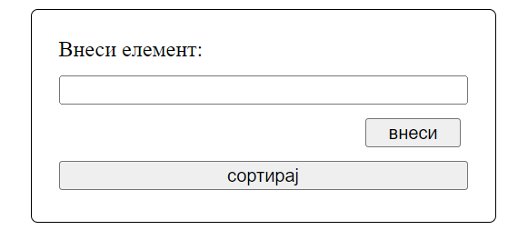
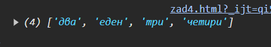

# Интернет програмирање

# Полиња

# Задача 4

Да се направи веб страница која содржи текстуално поле за внесување на елементи во низа, копче за внесување на елементите
и копче за сортирање на елементите.При кликање на копчето за внесување, елементот се зачувуваа во низата (се внесува еден
и се кликнува внеси), а при кликање на копчето за сортирање, елементите во низата се сортираат по азбучен редослед и се печатат во конзола.





# Решение:

```html
<!doctype html>
<html lang="en">
  <head>
    <meta charset="UTF-8" />
    <title>Задача 4</title>
    <style>
      #container {
        width: 300px;
        height: 115px;
        margin: auto;
        padding: 20px;
        border: 1px solid black;
        border-radius: 5px;
        display: flex;
        flex-direction: column;
        gap: 10px;
      }

      #insert {
        margin-left: auto;
        margin-right: 5px;
        width: 70px;
      }
    </style>
  </head>
  <body>
    <div id="container">
      <label for="inp">Внеси елемент:</label>
      <input type="text" id="inp" />
      <button id="insert" onclick="insertElement()">внеси</button>
      <button onclick="sortArr()">сортирај</button>
    </div>
    <script type="text/javascript">
      let arr = [];
      function insertElement() {
        let el = document.getElementById("inp");
        arr.push(el.value); //додавање на елемент во низата
        el.value = "";
      }

      function sortArr() {
        arr.sort(); //сортирање на низата
        console.log(arr); //печатење на низата во конзола
      }
    </script>
  </body>
</html>
```
