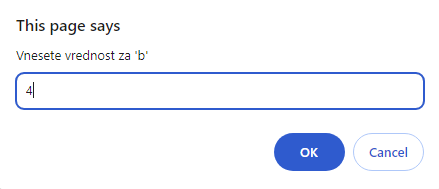
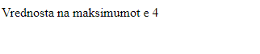

# Задача

Да се напише програма со која ќе се отпечати максимумот од два броја чии вредности се читаат од тастатура.







# Решение
```html

<!doctype html>
<html>
  <head> </head>
  <body>
    <script type="text/javascript">
      let a = prompt("Vnesete vrednost za 'a'");
      let b = prompt("Vnesete vrednost za 'b'");
      a = parseInt(a); // ковенртира string во број
      b = parseInt(b); // има и parseFloat() за децимални броеви
      if (!isNaN(a) && !isNaN(b)) {
        // проверува дали се броеви
        if (a > b) {
          document.write("Vrednosta na maksimumot e " + a);
        } else {
          document.write("Vrednosta na maksimumot e " + b);
        }
      } else {
        document.write("Ne ste vnesile cel broj!");
      }
    </script>
  </body>
</html>

```
