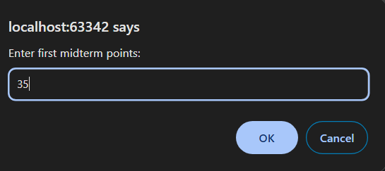
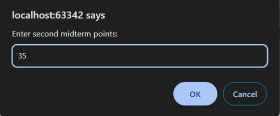
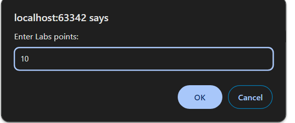
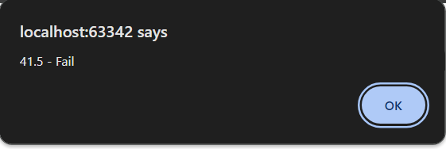

1 Задача

Да се напише програма во која преку prompt ќе се внесат поените од прв колоквиум, втор колоквиум и лабораториски вежби кои студентот ги има освоено, а потоа ќе се провери дали тој го има положено предметот. Студент го положува предметот доколку има освоено минимум 50 поени. Сумарните поени се пресметуваат по формулата: midterm1 * 0.45 + midterm2 * 0.45 + labs.
Доколку студентот има освоено ПОМАЛКУ од 30 поени на некој од колоквиумите предметот НЕ е положен.
Во alert прозорец да се прикаже соодветна порака во формат: totalPoints - Pass/Fail.










# Решение
```html

<!DOCTYPE html>
<html lang="en">
<head>
    <meta charset="UTF-8">
    <title>Title</title>
</head>
<body>
</body>
<script>
    // Внесување на освоените поени соодветно
    let firstTerm = prompt("Enter first midterm points:");
    let secondTerm = prompt("Enter second midterm points:");
    let labs = prompt("Enter Labs points:");
    firstTerm = parseFloat(firstTerm);
    secondTerm = parseFloat(secondTerm);
    labs = parseFloat(labs);

    // Пресметување на сумарните поени според формулата
    const totalPoints = firstTerm * 0.45 + secondTerm * 0.45 + labs;

    // Проверка дали студентот го положил предметот
    if (totalPoints < 50 || firstTerm < 30 || secondTerm < 30) {
        alert(totalPoints + " - Fail");
    } else {
        alert(totalPoints + " - Pass");
    }
</script>
</html>

```
