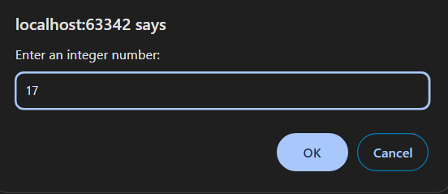
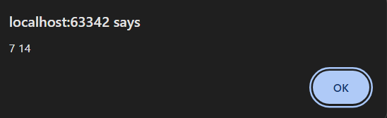

10 Задача

Да се напише програма во која преку prompt ќе се внесе еден цел број, а во alert прозорец ќе се прикажат сите броеви во интервалот од 0 до внесениот број кои се на непарно растојание од него.






# Решение
```html

<!DOCTYPE html>
<html lang="en">
<head>
    <meta charset="UTF-8">
    <title>Title</title>
</head>
<body>
</body>
<script>
    let number = prompt("Enter an integer number:");
    number = parseInt(number);
    let result = "";
    for (let i = 0; i <= number; i++) {

        // Проверка за непарно растојание
        if (Math.abs(number - i) % 2 === 1) {
            result += i + " ";
        }
    }

    // Приказ на резултатот
    alert(result);
</script>
</html>

```
