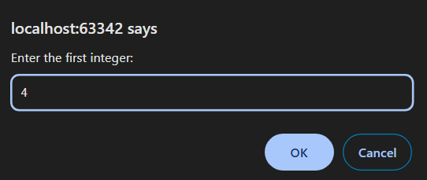
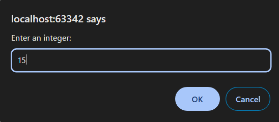
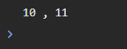

2 Задача

Да се напише програма во коjа преку тастатура се внесува еден цел број, а потоа се внесуваат броеви се додека не се внесе знак што не е цифра. Ваша задача е да ги најдете најголемото парно и непарно растојание до внесениот број на почеток. Истите да бидат прикажани во конзола одделени со запирка. Доколку некое од растојанијата не постои да се прикаже пораката: There is no even/odd distance.









# Решение
```html

<!DOCTYPE html>
<html lang="en">
<head>
    <meta charset="UTF-8">
    <title>Title</title>
</head>
<body>
</body>
<script>
    // Внесување на бројот на почеток и негово парсирање
    let startNum = prompt("Enter the first integer:");
    startNum = parseInt(startNum);

    // Променливи за чување на најголемото парно и непарно растојание
    let maxEvenDistance = -1;
    let maxOddDistance = -1;

    // Внесување на броеви сè додека не се внесе знак кој не е цифра
    while (true) {
        let number = prompt("Enter an integer:");
        number = parseInt(number);
        if (isNaN(number)) {
            break;
        }
        // Пресметка на растојанието до внесениот број
        let distance = Math.abs(startNum - number);

        // Проверка за парно или непарно растојание и ажурирање на најголемото растојание
        if (distance % 2 === 0) {
            if (distance > maxEvenDistance) {
                maxEvenDistance = distance;
            }
        } else {
            if (distance > maxOddDistance) {
                maxOddDistance = distance;
            }
        }
    }

    // Прикажување на резултатите во конзола
    if (maxEvenDistance === -1 && maxOddDistance === -1) {
        console.log("There is no even and odd distance.");
    } else if (maxEvenDistance === -1) {
        console.log("There is no even distance.");
    } else if (maxOddDistance === -1) {
        console.log("There is no odd distance.");
    } else {
        console.log(maxEvenDistance + " , " + maxOddDistance);
    }
</script>
</html>

```
