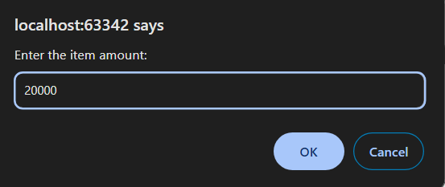
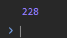

3 Задача

Да се напише програма во која ќе се пресмета провизијата која студент треба да ја плати на ФИНКИ. Најпрво се внесува број кој означува вкупен број на ставки, а потоа, соодветно се внесуваат износите на сите платени ставки од страна на студентот. Провизијата која што тој треба да ја плати изнесува 1.14% (но најмалку 3 денари, а најмногу 300). Резултатот да се прикаже во конзола, а децималните износи да се заокружат со Math.round.






# Решение
```html

<!DOCTYPE html>
<html lang="en">
<head>
    <meta charset="UTF-8">
    <title>Title</title>
</head>
<body>
</body>
<script>
    let totalItems = prompt("Enter the total number of items:");
    totalItems = parseInt(totalItems);
    let totalAmount = 0;

    // Внесување на износите за секоја ставка
    for (let i = 0; i < totalItems; i++) {
        let amount = prompt("Enter the item amount:");
        amount = parseFloat(amount);
        totalAmount += amount;
    }

    // Пресметка на провизијата
    let commission = totalAmount * 0.0114;
    commission = Math.round(commission);

    // Обезбедување минимална провизија од 3 денари
    if (commission < 3) {
        commission = 3;
    }

    // Обезбедување максимална провизија од 300 денари
    if (commission > 300) {
        commission = 300;
    }
    console.log(commission);
</script>
</html>

```
