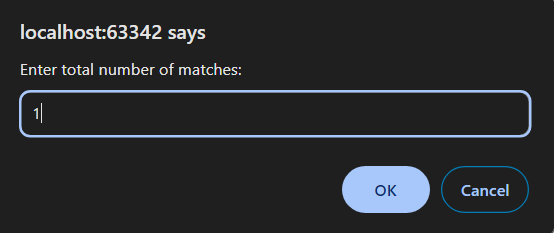
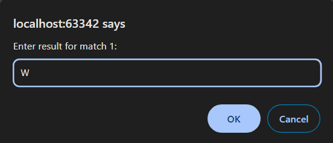
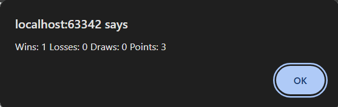

4 Задача

Да се напише програма во која ќе се прикажат бројот на победи, порази, нерешени натпревари и вкупниот број на освоени поени на еден фудбалски тим. Најпрво преку тастатура се внесува вкупен број на одиграни натпревари, а потоа, соодветно нивниот исход. Вкупниот број на освоени поени се пресметува со формулата: wins * 3 + draws * 1. Во allert прозорец да се прикаже дистрибуцијата во формат: wins losses draws points.
Појаснување: Се внесуваат знаци каде W означува победа, L означува пораз, а D означува нерешен резултат. Да се прекине со внесување доколку се внесе нешто различно и прикаже соодветна порака.








# Решение
```html

<!DOCTYPE html>
<html lang="en">
<head>
    <meta charset="UTF-8">
    <title>Title</title>
</head>
<body>
</body>
<script>
    // Внесување вкупен број одиграни натпревари
    let totalMatches = prompt("Enter total number of matches:");
    totalMatches = parseInt(totalMatches);
    let wins = 0, losses = 0, draws = 0;

    for (let i = 0; i < totalMatches; i++) {
        let result = prompt(`Enter result for match ${i + 1}:`);
        result = result.toUpperCase();

        // Проверка на валидноста на инпутот
        if (result !== 'W' && result !== 'L' && result !== 'D') {
            alert("Invalid input!");
            break;
        }

        // Броење победи, порази или нерешени
        if (result === 'W') {
            wins++;
        } else if (result === 'L') {
            losses++;
        } else if (result === 'D') {
            draws++;
        }
    }

    // Пресметување на поените
    const points = wins * 3 + draws;

    // Приказ на резултатите
    alert("Wins: " + wins + " Losses: " + losses + " Draws: " + draws + " Points: " + points);
</script>
</html>

```
