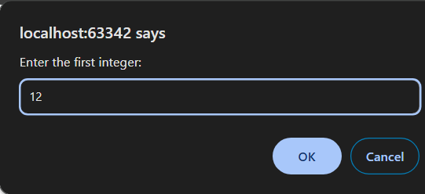
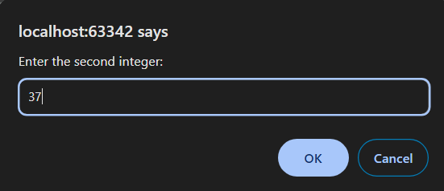
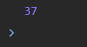

5 Задача

Да се напише програма во која преку prompt ќе се внесат два цели броја, а потоа ќе се најде најголемиот „специјален“ број во интервалот помеѓу овие два броја и истиот ќе се прикаже во конзола. „Специјален број“ е број составен само од непарни цифри. Доколку таков број не постои да се прикаже пораката: There is no special number.








# Решение
```html

<!DOCTYPE html>
<html lang="en">
<head>
    <meta charset="UTF-8">
    <title>Title</title>
</head>
<body>
</body>
<script>
    // Внесување на два цели броеви
    let num1 = prompt("Enter the first integer:");
    num1 = parseInt(num1);
    let num2 = prompt("Enter the second integer:");
    num2 = parseInt(num2);
    let hasFound = false;
    let greatestNum = -Infinity;

    // Барање на "специјален број" итерирајќи во интервалот
    for (let i = num1; i <= num2; i++) {
        let num = i;

        // Проверка на цифрите на бројот
        while (num > 0) {
            const digit = num % 10;
            if (digit % 2 === 0) {
                break;
            }
            num = Math.floor(num / 10);
        }

        // Ажурирање на бројот кој го исполнува условот за "специјален број"
        if (num === 0 && i > greatestNum) {
            greatestNum = i;
            hasFound = true;
        }
    }

    // Приказ на резултатот во конзола
    if (hasFound) {
        console.log(greatestNum);
    } else {
        console.log("There is no special number.");
    }
</script>
</html>

```
