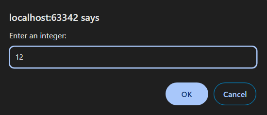
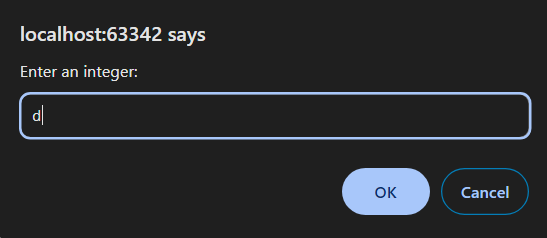
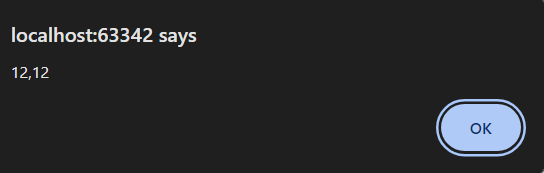

6 Задача

Да се напише програма во коjа преку prompt се внесуваат броеви се додека не се внесе знак што не е цифра(број). Во alert прозорец да бидат прикажани бројот чиј што збир на цифри е најголем и бројот чиј што производ на цифри е најмал меѓусебно одделени со запирка. Доколку не е внесен ниту еден број да се прикаже пораката: You did not enter any numbers.








# Решение
```html

<!DOCTYPE html>
<html lang="en">
<head>
    <meta charset="UTF-8">
    <title>Title</title>
</head>
<body>
</body>
<script>
    // Внесување на првиот број
    let input = prompt("Enter an integer:");
    input = parseInt(input);
    let maxSum = -Infinity;
    let minProduct = Infinity;
    let numberWithMaxSum;
    let numberWithMinProduct;

    while (!isNaN(input)) {
        let number = parseInt(input);
        let sum = 0;
        let product = 1;

        // Пресметка на збир и производ на цифрите
        while (number) {
            const digit = number % 10;
            sum += digit;
            product *= digit;
            number = Math.floor(number / 10);
        }

        // Проверка дали има потреба од нови ажурирања
        if (sum > maxSum) {
            maxSum = sum;
            numberWithMaxSum = input;
        }
        if (product < minProduct) {
            minProduct = product;
            numberWithMinProduct = input;
        }
        input = prompt("Enter an integer:");
        input = parseInt(input);
    }

    // Прикажување на резултатите во alert прозорец
    if (numberWithMaxSum !== undefined && numberWithMinProduct !== undefined) {
        alert(numberWithMaxSum + "," + numberWithMinProduct);
    } else {
        alert("You did not enter any numbers.");
    }
</script>
</html>

```
