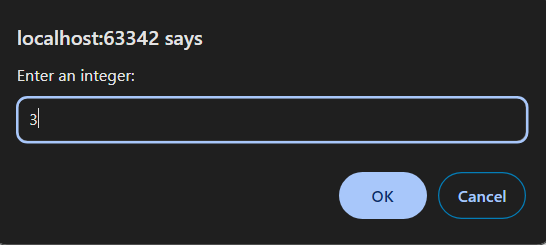
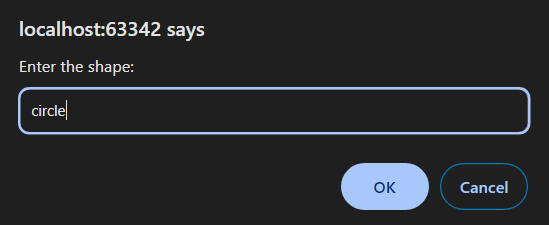
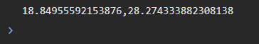

7 Задача

Да се напише програма во која преку тастатура прво ќе се внесе еден цел број, а потоа се внесува името на формата за која сакаме да пресметаме периметар и плоштина (square, circle, rectangle). Доколку станува збор за правоаголник да се овозможи внесување на уште еден цел број. Пресметаните вредности да се прикажат во конзола одделени со запирка во формат: perimeter,area.
Забелешка: Доколку се внесе бројот 0 за димензија на форма да се прикаже пораката: Dimension 0 is not allowed!








# Решение
```html

<!DOCTYPE html>
<html lang="en">
<head>
    <meta charset="UTF-8">
    <title>Title</title>
</head>
<body>
</body>
<script>
    // Внесување на целиот број и името на формата
    let number = prompt("Enter an integer:");
    number = parseInt(number);
    let shape = prompt("Enter the shape:");
    shape = shape.toLowerCase();
    let perimeter, area;

    // Проверка за внес на димензии за формата
    if (number === 0) {
        console.log("Dimension 0 is not allowed!");
    } else {
        // Пресметка на периметар и плоштина во зависност од формата
        if (shape === "square") {
            perimeter = 4 * number;
            area = Math.pow(number, 2);
        } else if (shape === "circle") {
            perimeter = 2 * Math.PI * number;
            area = Math.PI * number * number;
        } else if (shape === "rectangle") {
            let secondNumber = prompt("Enter a second dimension for the rectangle:");
            secondNumber = parseInt(secondNumber);
            if (secondNumber === 0) {
                console.log("Dimension 0 is not allowed!");
            } else {
                perimeter = 2 * (number + secondNumber);
                area = number * secondNumber;
            }
        }

        // Прикажување на пресметаните вредности во конзола
        if (perimeter !== undefined && area !== undefined) {
            console.log(perimeter + "," + area);
        }
    }
</script>
</html>

```
