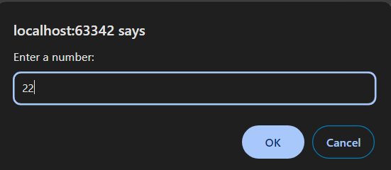
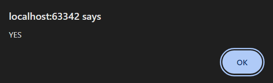
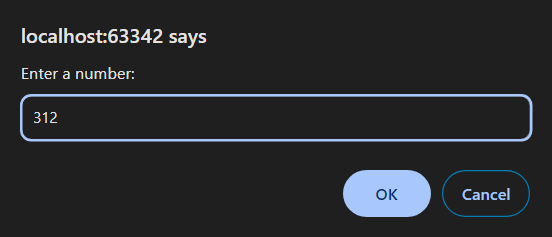
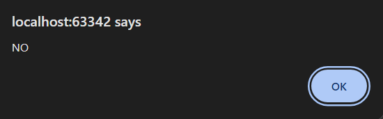
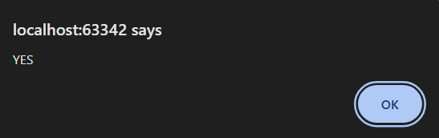

8 Задача

Да се напише програма во која ќе се најде обратниот број на внесен број преку тастатура. На крај да се провери дали обратниот број е делив со цифрата на единиците на внесениот број. Доколку условот е исполнет во alert прозорец да се прикаже порака: YES, доколку не е исполнет да се прикаже порака: NO.
Забелешка: Доколку е внесен децимален број, работете само со неговиот цел дел.













# Решение
```html

<!DOCTYPE html>
<html lang="en">
<head>
    <meta charset="UTF-8">
    <title>Title</title>
</head>
<body>
</body>
<script>
    // Внесување на бројот
    let number = prompt("Enter a number:");
    number = parseInt(number);

    // Променлива за чување на обратниот број
    let reversedNumber = 0;
    let tempNumber = Math.floor(number);

    // Пресметување на обратниот број
    while (tempNumber > 0) {
        const digit = tempNumber % 10;
        reversedNumber = reversedNumber * 10 + digit;
        tempNumber = Math.floor(tempNumber / 10);
    }

    // Проверка дали обратниот број е делив со цифрата на единиците од внесениот број
    const ones = number % 10;
    if (reversedNumber % ones === 0) {
        alert("YES");
    } else {
        alert("NO");
    }
</script>
</html>

```
