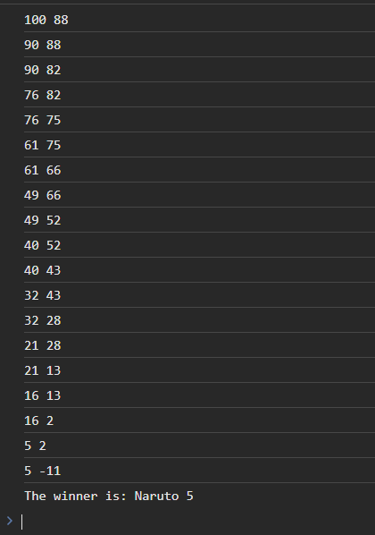
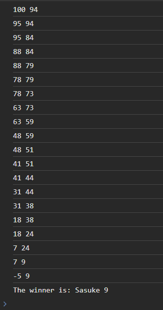

9 Задача

Напишете програма со која се симулира едноставна игра каде се борат Naruto против Sasuke. На почетокот и двајцата имаат HP со вредност 100. Играта се одвива на тој начин што Naruto и Sasuke наизменично се напаѓаат еден со друг се додека еден од нив не дојде до 0 или помалку HP. Секој напад го намалува HP на противникот за случаен износ помеѓу 5 и 15. Првиот удар го задава Naruto, а после секој напад во конзола се прикажуваат нивните HP во тој момент. На крајот прикажете го името на победникот и неговите HP во формат: The winner is: player playerHP.






# Решение
```html

<!DOCTYPE html>
<html lang="en">
<head>
    <meta charset="UTF-8">
    <title>Title</title>
</head>
<body>
</body>
<script>
    // Иницијализирање на HP
    let narutoHP = 100;
    let sasukeHP = 100;
    let damageToSasuke, damageToNaruto;

    while (true) {
        // Нападот на Naruto
        damageToSasuke = Math.floor(Math.random() * 11) + 5;
        sasukeHP -= damageToSasuke;
        console.log(narutoHP + " " + sasukeHP);
        if (sasukeHP <= 0) {
            console.log("The winner is: Naruto " + narutoHP);
            break;
        }

        // Нападот на Sasuke
        damageToNaruto = Math.floor(Math.random() * 11) + 5;
        narutoHP -= damageToNaruto;
        console.log(narutoHP + " " + sasukeHP);
        if (narutoHP <= 0) {
            console.log("The winner is: Sasuke " + sasukeHP);
            break;
        }
    }
</script>
</html>

```
