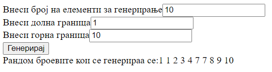

# Задача

Да се креира веб страница која содржи поле за внесување на бројот на рандом елементи кои треба да се генерираат и полиња за границите во кои тие треба да бидат генерирани.
Да се користи Math.floor() за да се добиат целите вредности на броевите.

Генерираните броеви испечатете ги на соодветното место сортирани во растечки редослед.



# Решение

```html
<!doctype html>
<html>
  <head>
    <meta lang="mk" charset="UTF-8">
    <script type="text/javascript">
      function generate() {
        let broj = document.getElementById("broj").value; // ги земаме вредностите од полињата
        let dolnaGranica = document.getElementById("dolna").value;
        let gornaGranica = document.getElementById("gorna").value;
        let divZaPechatenje = document.getElementById("broevi");

        let randomArr = [];

        broj = parseInt(broj); // се парсираат влезовите
        dolnaGranica = parseInt(dolnaGranica);
        gornaGranica = parseInt(gornaGranica);

        for (let i = 0; i < broj; i++) {
          randomArr.push(Math.floor(Math.random() * (gornaGranica + 1 - dolnaGranica) + dolnaGranica)); // се додаваат елементи на низата со функцијата push();
        }

        randomArr = randomArr.sort((a, b) => a - b); // Се става компаратор израз во функцијата за се сортира според integer вредноста, а не според ASCII

        divZaPechatenje.innerHTML = "Рандом броевите кои се генерираа се:"

        for (let i = 0; i < broj; i++) {
          divZaPechatenje.innerHTML += randomArr[i] + " ";
        }
      }
    </script>
  </head>
  <body>
    <div>
      <label for="broj">Внеси број на елементи за генерирање</label><input type="text" id="broj">
    </div>
    <div>
      <label for="dolna">Внеси долна граница</label><input type="text" id="dolna">
    </div>
    <div>
      <label for="gorna">Внеси горна граница</label><input type="text" id="gorna">
    </div>
    <button onclick="generate()">Генерирај</button>
    <div id="broevi">Рандом броевите кои се генерираа се:</div>
  </body>
</html>


```