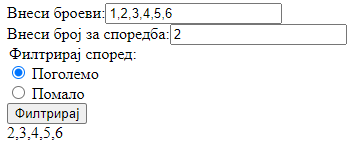

# Задача 3

Да се креира веб страница каде броевите внесени во текстуално поле, одделени со запирка, се филтрираат според тоа дали
се поголеми или помали од даден број.

**Да се користи методот filter().**



# Решение

```html
<!doctype html>
<html>
  <head>
    <meta charset="UTF-8" />
    <script>
      function filterNumbers() {
        let broevi = document.getElementById("broevi").value; // ги земаме вредностите од полињата
        let addDiv = document.getElementById("addHere");
        let radio = document.getElementsByName("pogpom");
        let broj = document.getElementById("broj").value;

        broevi = broevi.split(",");
        broj = parseInt(broj);

        broevi = broevi.map((x) => parseInt(x));

        if (radio[0].checked) {
          // проверуваме кој radio button е селектиран
          broevi = broevi.filter((x) => x > broj);
        } else {
          broevi = broevi.filter((x) => x < broj);
        }

        addDiv.innerHTML = broevi;
      }
    </script>
  </head>
  <body>
    <div>
      <label for="broevi">Внеси броеви:</label><input type="text" id="broevi" />
    </div>
    <div>
      <label for="broj">Внеси број за споредба:</label
      ><input type="text" id="broj" />
    </div>
    <legend>Филтрирај според:</legend>
    <div>
      <input
        type="radio"
        id="pogolemo"
        name="pogpom"
        value="pogolemo"
        checked
      />
      <label for="pogolemo">Поголемо</label>
    </div>

    <div>
      <input type="radio" id="pomalo" name="pogpom" value="pomalo" checked />
      <label for="pomalo">Помало</label>
    </div>
    <button onclick="filterNumbers()">Филтрирај</button>
    <div id="addHere"></div>
  </body>
</html>
```
