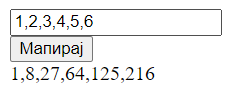

# Задача 4

Да се креира веб страница каде внесените броеви во полето ќе се мапираат во нивниот кубен производ.
Броевите се внесуваат одделени со празно место.

**Да се користи функцијата map().**



# Решение

```html
<!doctype html>
<html lang="en">
  <head>
    <meta charset="UTF-8" />
    <script>
      function mapToCubic() {
        let broevi = document.getElementById("broevi").value; // ги земаме вредностите од полињата
        let addDiv = document.getElementById("addHere");
        broevi = broevi.split(",");

        broevi = broevi.map((x) => parseInt(x)).map((x) => Math.pow(x, 3)); // прво се мапираат во integer, а потоа се мапираат во кубниот производ
        addDiv.innerHTML = broevi;
      }
    </script>
  </head>
  <body>
    <div><label for="broevi"></label><input type="text" id="broevi" /></div>
    <button onclick="mapToCubic()">Мапирај</button>
    <div id="addHere"></div>
  </body>
</html>
```
