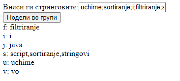

# Задача 6

Да се креира веб страница каде дадена низа стрингови внесена во поле (разделени со ;), ќе ги подели во групи според првата буква и ќе ги прикаже на екран сортирани во растечки редослед.



# Решение

```html
<!doctype html>
<html>
  <head>
    <meta charset="UTF-8" />
    <script>
      function groupStrings() {
        let strings = document.getElementById("vlez").value;
        strings = strings.split(";");

        let addDiv = document.getElementById("addDiv");

        for (let i = 97; i < 97 + 26; i++) {
          // ASCII вредноста на карактерот 'a' е 97, а на карактерот 'z' е 97+26, па затоа се итерира низ овие вредности
          let nizaZaDodavanje = strings
            .filter((x) => x.toLowerCase().charCodeAt(0) === i)
            .sort(); // се користи filter за да се одделат според карактери
          if (nizaZaDodavanje.length === 0) {
            // доколку нема зборови, се скока од додавање
            continue;
          }
          addDiv.innerHTML +=
            String.fromCharCode(i) + ": " + nizaZaDodavanje + "<br>"; // fromCharCode конверитра одреден integer во карактер
        }
      }
    </script>
  </head>
  <body>
    <div>
      <label for="vlez">Внеси ги стринговите:</label
      ><input type="text" id="vlez" />
    </div>
    <button onclick="groupStrings();">Подели во групи</button>

    <div id="addDiv"></div>
  </body>
</html>
```
