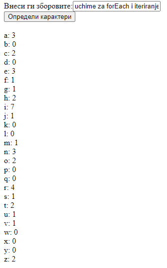

# Задача 7

Да се креира веб страна каде во текстуално поле се внесуваат зборови, одделени со празно место, а потоа ќе се определат сите уникатни карактери кои се содржат во зборовите.



# Решение

```html
<!doctype html>
<html>
  <head>
    <meta charset="UTF-8" />
    <script>
      function unikatniKarakteri() {
        let zborovi = document.getElementById("vlez").value;
        zborovi = zborovi.split(" ");

        let addDiv = document.getElementById("addDiv");

        let brojKarakteri = []; // бројот на повторувања на a ќе биде означено на индекс 0, b на 1, c на 2, итн...
        for (let i = 0; i < 26; i++) {
          brojKarakteri.push(0);
        }

        zborovi.forEach((x) =>
          [...x].forEach((char) => brojKarakteri[char.charCodeAt(0) - 97]++),
        ); // [...x] го конвертира секој збор како поле, на кое може да се употреби функцијата forEach

        for (let i = 0; i < 26; i++) {
          addDiv.innerHTML +=
            "<br>" + String.fromCharCode(i + 97) + ": " + brojKarakteri[i];
        }
      }
    </script>
  </head>
  <body>
    <div>
      <label for="vlez">Внеси ги зборовите:</label
      ><input type="text" id="vlez" />
    </div>
    <button onclick="unikatniKarakteri();">Определи карактери</button>

    <div id="addDiv"></div>
  </body>
</html>
```
