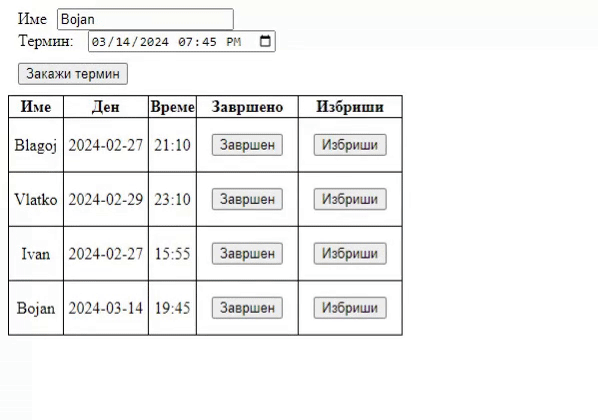

# Задача 8

Да се креира веб страница за закажување термини во берберница. Во текстуално поле се внесува името на клиентот, преку календар се внесува денот, а преку multiline листа се внесува времето на терминот.
Сите термини имаат времетраење од 30 минути!

Да се додаде копче за евидентирање на завршените термини и копче за бришење на термин.

_Да не се дозволува закажување на повеќе од еден термин за даден клиент!_
_**Да се оневозможи закажување на повеќе клиенти во ист термин!**_



# Решение

```html
<!doctype html>
<html lang="en">
  <head>
    <meta charset="UTF-8" />
    <style>
      label {
        margin: 10px;
      }

      button {
        margin: 10px;
      }

      table,
      th,
      td {
        border: 1px solid black;
        border-collapse: collapse;
      }

      td {
        padding: 5px;
        text-align: center;
      }

      select {
        margin: 10px;
      }
    </style>
    <script>
      let klienti = [];
      let termini = [];

      function zakazhi() {
        let ime = document.getElementById("ime").value;
        let data = document.getElementById("kalendar").value;
        let vreme = document.getElementById("vreme").value;
        let tabela = document.getElementById("tabelaZakazhani");

        let termin = data + "T" + vreme; // ги конкатинираме датумот и времето за да добиеме термин

        if (termini.findIndex((x) => x === termin) !== -1) {
          // ако findIndex врати -1, тогаш terminot не е пронајден во низата од термини и може да се додаде
          alert("Terminot e vekje zafaten!");
          return;
        }
        if (klienti.findIndex((x) => x === ime) !== -1) {
          alert("Klientot ima zakazhano termin!");
          return;
        }

        klienti.push(ime);
        termini.push(termin);

        tabela.innerHTML +=
          "<tr><td>" +
          ime +
          "</td>\n" +
          "<td>" +
          data +
          "</td>\n" +
          "<td>" +
          vreme +
          "</td>\n" +
          "<td><button onclick='finish(this)'>Завршен</button></td>\n" +
          "<td><button onclick='remove(this)'>Избриши</button></td></tr>\n";
      }

      function finish(ref, ime) {
        ref.parentNode.parentNode.style.background = "green"; // преку style.background можеме да ги менуваме својствата на елементот
        let indexToRem = klienti.findIndex((x) => x === ime);
        klienti.splice(indexToRem, 1); // го бришиме клиентот од листата за да овозможиме повторно да закаже термин
        termini.splice(indexToRem, 1);
      }

      function remove(ref, ime) {
        let row = ref.parentNode.parentNode; // пристапуваме до родителот на копчето, што е td, па потоа до родителот на td, што е tr
        row.parentNode.removeChild(row); // го бришиме редот во кој се наоѓа копчето
        let indexToRem = klienti.findIndex((x) => x === ime);
        klienti.splice(indexToRem, 1); // го бришиме клиентот од листата за да овозможиме повторно да закаже термин
        termini.splice(indexToRem, 1);
      }
    </script>
  </head>
  <body>
    <div><label for="ime">Име</label><input type="text" id="ime" /></div>
    <div>
      <label for="kalendar">Ден:</label>
      <input type="date" id="kalendar" />
      <br />
      <label for="vreme">Избери време:</label>
      <br />
      <select id="vreme" size="4">
        <option value="09:00">09:00</option>
        <option value="09:30">09:30</option>
        <option value="10:00">10:00</option>
        <option value="10:30">10:30</option>
        <option value="11:00">11:00</option>
        <option value="11:30">11:30</option>
        <option value="12:00">12:00</option>
        <option value="12:30">12:30</option>
        <option value="13:00">13:00</option>
        <option value="13:30">13:30</option>
        <option value="14:00">14:00</option>
        <option value="14:30">14:30</option>
        <option value="15:00">15:00</option>
        <option value="15:30">15:30</option>
        <option value="16:00">16:00</option>
        <option value="16:30">16:30</option>
        <option value="17:00">17:00</option>
        <option value="17:30">17:30</option>
        <option value="18:00">18:00</option>
        <option value="18:30">18:30</option>
      </select>
    </div>
    <div>
      <button onclick="zakazhi();">Закажи термин</button>
    </div>
    <table id="tabelaZakazhani">
      <thead>
        <th>Име</th>
        <th>Ден</th>
        <th>Време</th>
        <th>Завршено</th>
        <th>Избриши</th>
      </thead>
    </table>
  </body>
</html>
```
