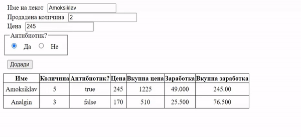

# Задача 8

Да се креира веб страница за евидентирање на продадени лекови. Во текстуални полиња се внесува името на лекот, количината која се продала и цената на лекот.
Преку radio копче се внесува дали лекот е антибиотик или не.
Во табелата да се додаде и колона за заработката од лекот. Доколку лекот е антибиотик, заработката изнесува 20% од цената, а доколку не е 15%.

Доколку се додава веќе постоечки лек да се променат податоците само во табелата, да не се додава во нов ред.

_Сите полиња да бидат пополнети пред додавање!_



# Решение

```html
<!doctype html>
<html>
  <head>
    <meta charset="UTF-8" />
    <style>
      label {
        margin: 10px;
      }

      fieldset {
        display: inline;
      }

      button {
        margin: 10px;
      }

      table,
      th,
      td {
        border: 1px solid black;
        border-collapse: collapse;
      }

      td {
        padding: 5px;
        text-align: center;
      }
    </style>

    <script>
      let lekovi = [];
      let ceni = [];
      let kolicini = [];
      let antibiotikBools = [];

      function dodadiLek() {
        let tabela = document.getElementById("tabelalek"); // ви вчитуваме полињата
        let ime = document.getElementById("ime").value;
        let kolicina = parseInt(document.getElementById("kolicina").value);
        let cena = parseInt(document.getElementById("cena").value);

        let antibiotik = document.getElementsByName("antibiotik");

        if (!ime || !kolicina || !cena) {
          // правиме проверка за полињата
          alert("Ne se vneseni site polinja!");
          return;
        }

        if (antibiotik[0].checked) {
          // проверуваме дали е антибиотик
          antibiotik = true;
        } else {
          antibiotik = false;
        }

        let id = lekovi.findIndex((x) => x === ime); // доколку го има лекот во листата на лекови, ќе се врати неговиот индекс, но доколку го нема, id ќе биде -1

        if (id !== -1) {
          kolicini[id] += kolicina;
        } else {
          lekovi.push(ime);
          kolicini.push(kolicina);
          ceni.push(cena);
          antibiotikBools.push(antibiotik);
        }

        tabela.innerHTML =
          "<tr>\n" +
          "<th>Име</th>\n" +
          "<th>Количина</th>\n" +
          "<th>Антибиотик?</th>\n" +
          "<th>Цена</th>\n" +
          "<th>Вкупна цена</th>\n" +
          "<th>Заработка</th>\n" +
          "<th>Вкупна заработка</th>\n" +
          "</tr>";

        for (let i = 0; i < lekovi.length; i++) {
          // за ажурирање на податоците од почеток се креира целата табела
          let zarabotka = antibiotikBools[i] ? ceni[i] * 0.2 : ceni[i] * 0.15; // со тернарен оператор ? одредуваме дали цената ќе се множи со 0.2 или 0.15
          tabela.innerHTML +=
            "<tr>\n" +
            "<td>" +
            lekovi[i] +
            "</td>\n" +
            "<td>" +
            kolicini[i] +
            "</td>\n" +
            "<td>" +
            antibiotikBools[i] +
            "</td>\n" +
            "<td>" +
            ceni[i] +
            "</td>\n" +
            "<td>" +
            kolicini[i] * ceni[i] +
            "</td>\n" +
            "<td>" +
            zarabotka.toPrecision(5) +
            "</td>\n" +
            "<td>" +
            (zarabotka * kolicini[i]).toPrecision(5) +
            "</td>\n" +
            "</tr>";
        }
      }
    </script>
  </head>
  <body>
    <div>
      <label for="ime">Име на лекот</label><input type="text" id="ime" />
    </div>
    <div>
      <label for="kolicina">Продадена количина</label
      ><input type="text" id="kolicina" />
    </div>
    <div><label for="cena">Цена</label><input type="text" id="cena" /></div>
    <fieldset>
      <legend>Антибиотик?</legend>
      <div>
        <input type="radio" id="da" name="antibiotik" value="da" />
        <label for="da">Да</label>

        <input type="radio" id="ne" name="antibiotik" value="ne" />
        <label for="da">Не</label>
      </div>
    </fieldset>
    <div>
      <button onclick="dodadiLek();">Додади</button>
    </div>

    <table id="tabelalek"></table>
  </body>
</html>
```
