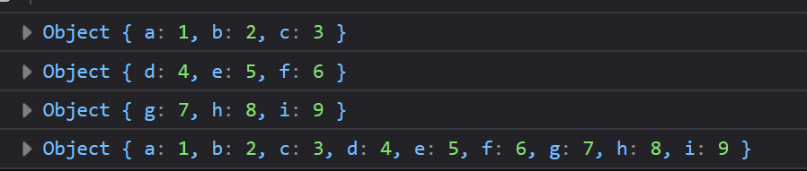

# Задача

Да се напише програма која ќе додаде атрибути на еден или повеќе објекти во друг.



# Решение

```html
<!doctype html>
<html>
  <head>
    <meta charset="UTF-8" />
  </head>
  <body>
    <script type="text/javascript">
      function merge(target, ...objects) {
        for (const object of objects) {
          for (const property in object) {
            target[property] = object[property];
          }
        }

        return target;

        // return Object.assign(target, ...objects)
      }

      const object1 = {
        a: 1,
        b: 2,
        c: 3,
      };

      const object2 = {
        d: 4,
        e: 5,
        f: 6,
      };

      const object3 = {
        g: 7,
        h: 8,
        i: 9,
      };

      console.log(object1);
      console.log(object2);
      console.log(object3);
      console.log(merge(object1, object2, object3));
    </script>
  </body>
</html>
```
