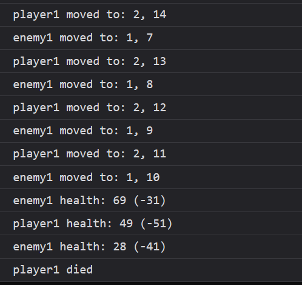
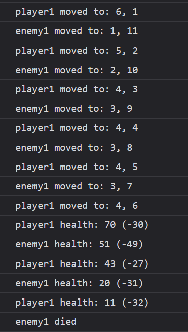

# Задача

Да се креира објект-класа `GameObject` што ќе содржи **id**, **position (position.x, position.y)** и **update(object_position)** кој го доближува самиот објект до објектот на таа позиција без да има колизија.

Од GameObject да наследува објект-класа `Entity` што ќе содржи **health** и **strength**. Дополнително да има функции:<br>
**attack(entity)**: Да го нападне ентитетот доколку е во неговиот радиус. Во спротивно да ја повика функцијата на неговиот родител за да се помести.<br>
**update(damage)**: Ја препокрива функцијата **update()** каде што ќе го намали **health**.

Од Entity да наследува објект-класа `Player` што ќе содржи **defense** и ја препокрива функцијата **update(damage)** каде што **damage** ќе ја намали за defense%.

Пресметка за **damage** = `Math.floor(Math.random() * 20) + (strength - 10)`




# Решение

```html
<!doctype html>
<html>
  <head>
    <meta charset="UTF-8" />
  </head>
  <body>
    <script type="text/javascript">
      class GameObject {
        constructor(id, x, y) {
          this.id = id;
          this.position = { x, y };
        }

        update(object_position) {
          let difference_x = object_position.x - this.position.x;
          let difference_y = object_position.y - this.position.y;

          // да нема судир
          // се поместува за +1 или -1 (се дели со Math.abs() за да подржува и негативно поместување)
          if (Math.abs(difference_x) > 1) {
            this.position.x += difference_x / Math.abs(difference_x);
          }

          if (Math.abs(difference_y) > 1) {
            this.position.y += difference_y / Math.abs(difference_y);
          }

          console.log(
            `${this.id} moved to: ${this.position.x}, ${this.position.y}`,
          );
        }
      }

      class Entity extends GameObject {
        constructor(id, x, y, health, strength) {
          super(id, x, y);
          this.health = health;
          this.strength = strength;
        }

        attack(entity) {
          let difference_x = Math.abs(entity.position.x - this.position.x);
          let difference_y = Math.abs(entity.position.y - this.position.y);

          if (difference_x > 1 || difference_y > 1)
            super.update(entity.position); // додека не се во близина
          else {
            let damage = Math.floor(Math.random() * 20) + (this.strength - 10); // формулата за damage
            entity.update(damage); // ажурира health
          }
        }

        update(damage) {
          this.health -= damage;

          if (this.health <= 0) console.log(`${this.id} died`);
          else console.log(`${this.id} health: ${this.health} (${-damage})`);
        }
      }

      class Player extends Entity {
        constructor(id, x, y, health, strength, defense) {
          super(id, x, y, health, strength);
          this.defense = defense;
        }

        update(damage) {
          let new_damage = Math.floor(damage * (1 - this.defense / 100)); // намалување за defense%
          this.health -= new_damage;

          if (this.health <= 0) console.log(`${this.id} died`);
          else
            console.log(`${this.id} health: ${this.health} (${-new_damage})`);
        }
      }

      let player1 = new Player("player1", 2, 15, 100, 40, 10);
      let enemy1 = new Entity("enemy1", 1, 6, 100, 55);

      while (player1.health > 0 && enemy1.health > 0) {
        // додека двете се живи
        player1.attack(enemy1);
        if (enemy1.health > 0) enemy1.attack(player1); // ако случајно не умре
      }
    </script>
  </body>
</html>
```
