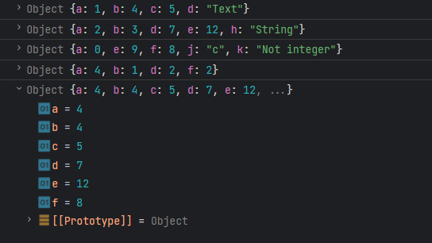

# Задача

Да се напише програма која иницијализира повеќе објекти со атрибути со integer вредности. Да се создаде нов објект кој ја има највисоката integer вредност на секој атрибут од другите објекти, игнорирајќи ги атрибутите кои не се од типот integer.



# Решение

```html
<!doctype html>
<head>
    <meta charset="UTF-8">
</head>
<body>
  <script type="text/javascript">
      function maxVrednost(...objects) {
          // Иницијализираме објект returnValue кој ќе е return вредноста од функцијата
          // и ќе ги содржи максималните вредности од другите објекти.
          const returnValue = {};

          objects.forEach(obj => {
              for (const [key, value] of Object.entries(obj)) {
				// Провери дали атрибутот е од тип integer
				if(Number.isInteger(value)) {
                  // Провери дали објектот го има атрибутот кој моментално го разгледуваме
                  if (returnValue.hasOwnProperty(key)) {
                      // Доколку има, се зема максималната вредност
                      returnValue[key] = Math.max(returnValue[key], value);
                  } else {
                      // Доколку нема, се додава вредоста
                      returnValue[key] = value;
                  }
				}
              }
          });

          return returnValue;
      }

      const obj1 = {a: 1, b: 4, c: 5, d: "Text"};
      const obj2 = {a: 2, b: 3, c: 2, d: 7, e: 12, h: "String"};
      const obj3 = {a: 0, b: 6, e: 9, f: 8, j: 'c', k: "Not integer"};
      const obj4 = {a: 4, b: 1, d: 2, f: 2};

      const maxObject = maxVrednost(obj1, obj2, obj3, obj4);
      console.log(obj1);
      console.log(obj2);
      console.log(obj3);
      console.log(obj4);
      console.log(maxObject);
  </script>
</body>
</html>
```
