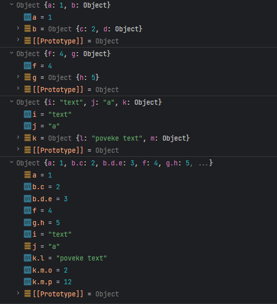

# Задача

Напиши програма која зема листа на објекти, земајќи ги нивните атрибути кои се објекти и поставувајќи ги во друг објект. Ако објектите кои се атрибути имаат атрибути кои се објекти (итн), тие исто така треба да бидат поставени во новиот објект но без нивниот родител.



# Решение

```html
<!doctype html>
<head>
    <meta charset="UTF-8">
</head>
<body>
<script type="text/javascript">
  // Прво правиме функција која рекурзивно оди низ атрибутите од објектите и
  // како return вредност врака објект без вгнездени објекти, претфорајќи ги
  // атрибутите од вгнездените објекти во атрибути.
  function flattenObject(obj, parent, res = {}) {
    for (let key in obj) {
      // Функцијата рекурзивно се повикува доколку во вгенздениот објект има
      // вгездени објекти.
      if (typeof obj[key] === 'object' && obj[key] !== null) {
        flattenObject(obj[key], parent ? `${parent}.${key}` : key, res);
      } else {
        // Во return вредноста, атрибутот од вгездениот објект се мапира како
        // нов атрибут со key "[име на родител].[оригинален key]"
        res[parent ? `${parent}.${key}` : key] = obj[key];
      }
    }
    return res;
  }

  // Оваа функција ги мапира сите атрибути земени со функцијата flattenObject во
  // еден објект.
  function mergeObjects(objects) {
    let result = {};
    objects.forEach(obj => {
      result = { ...result, ...flattenObject(obj) };
    });
    return result;
  }

  const obj1 = {
    a: 1,
    b: {
      c: 2,
      d: {
        e: 3
      }
    }
  }
  const obj2 = {
    f: 4,
    g: {
      h: 5
    }
  }
  const obj3 = {
    i: "text",
    j: 'a',
    k: {
      l: "poveke text",
      m: {
        o: 2,
        p: 12
      }
    }
  }
  const objects = [obj1, obj2, obj3];

  const mergedObject = mergeObjects(objects);
  console.log(obj1);
  console.log(obj2);
  console.log(obj3);
  console.log(mergedObject);
</script>
</body>
</html>
```
