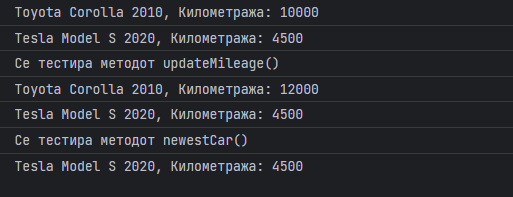

# Задача

Напиши програма која се дефинира класа Car со атрибути за производител, модел, година на производство и километража како и функција која ги печати сите атрибути. Напиши метод updateMileage(car, newMileage) кој е дефиниран надвор од класата и го апдејтира атрибутот за километража на колата.
Конечно направи метод newset(car1, car2) кој ја враќа поновата кола и испечати ги нејзините информации.



# Решение

```html
<!doctype html>
<head>
    <meta charset="UTF-8">
</head>
<body>
<script type="text/javascript">
    // Се дефинира класата Car
    class Car {
        constructor(by, model, year, mileage) {
            this.by = by;
            this.model = model;
            this.year = year;
            this.mileage = mileage;
        }

        printInfo() {
            console.log(`${this.by} ${this.model} ${this.year}, Километража: ${this.mileage}`);
        }
    }
    // Се дефинира функцијата updateMileage()
    function updateMileage(car, newMileage) {
        car.mileage = newMileage;
    }
    // Се дефинира функцијата newestCar()
    function newestCar(car1, car2) {
        if (car1.year > car2.year) return car1;
        else return car2;
    }
    // Се дефинираат 2 Car објекти
    car1 = new Car("Toyota", "Corolla", 2010, 10000);
    car2 = new Car("Tesla", "Model S", 2020, 4500);
    // Се тестира методот printInfo()
    car1.printInfo();
    car2.printInfo();
    // Се тестира методот updateMileage()
    console.log("Се тестира методот updateMileage()")
    updateMileage(car1, 12000);
    car1.printInfo();
    car2.printInfo();
    // Се тестира методот newestCar()
    console.log("Се тестира методот newestCar()")
    newestCar(car1, car2).printInfo();
</script>
</body>
</html>
```
