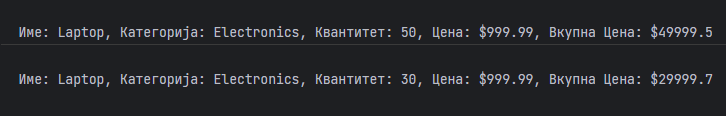

# Задача

Дефиниран е product објект. Потребно е да се напишат функции updateQuantity(product, newQuantity) која што ќе ја промени вредноста на quantity атриботот и displayProductDetails(product) која ќе испечати сите атрибути од објектот како и вкупна вредност што е еднаква на квантитетот помножен со цената.
Дефинирај ги функциите и покажи ја нивната функционалност со console.log().



# Даден Код

```html
<!doctype html>
<head>
    <meta charset="UTF-8">
</head>
<body>
<script type="text/javascript">
let product = {
    name: "Laptop",
    category: "Electronics",
    quantity: 50,
    price: 999.99
};
</script>
</body>
</html>
```

# Решение

```html
<!doctype html>
<head>
    <meta charset="UTF-8">
</head>
<body>
<script type="text/javascript">
    let product = {
        name: "Laptop",
        category: "Electronics",
        quantity: 50,
        price: 999.99
    };
    // Се дефинира функцијата updateQuantity
    function updateQuantity(product, newQuantity) {
        product.quantity = newQuantity;
    }
    // Се дефинира функцијата displayProductDetails
    function displayProductDetails(product) {
        console.log(`Име: ${product.name}, Категорија: ${product.category}, Квантитет: ${product.quantity}, Цена: $${product.price}, Вкупна Цена: $${product.price*product.quantity}`);
    }
    // Се тестира функцијата displayProductDetails
    displayProductDetails(product);
    // Се тестира updateQuantity.
    updateQuantity(product, 30);
    displayProductDetails(product);
</script>
</body>
</html>
```
