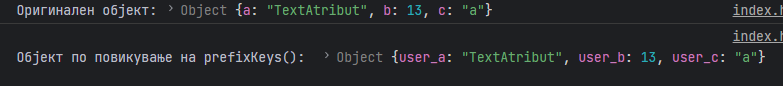

# Задача

Да се напише програма со која се зема објект и се менуваат keys на неговите атрибути така што ќе се додаде префикс по избор на корисникот.



# Решение

```html
<!doctype html>
<head>
    <meta charset="UTF-8">
</head>
<body>
<script type="text/javascript">
    // Ја дефинираме prefixKeys функцијата
    function prefixKeys(obj, prefix) {
        let newObj = {};
        // Се итерира низ Keys од дадениот објект и се внесуваат како Keys кои имаат
        // вредност [стар Key + префикс]
        for (let key in obj) {
            if (obj.hasOwnProperty(key)) {
                newObj[prefix + key] = obj[key];
            }
        }
        // Се враќа новиот објект.
        return newObj;
    }

    let originalObject = {
        a: "TextAtribut",
        b: 13,
        c: 'a'
    };

    let prefixedObject = prefixKeys(originalObject, "user_");
    console.log("Оригинален објект:", originalObject);
    console.log("Објект по повикување на prefixKeys(): ", prefixedObject);
</script>
</body>
</html>
```
