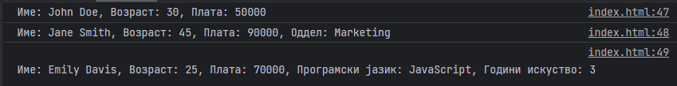

# Задача

Напиши програма која ќе претставува едноставна организација и ќе ги содржи класата Employee од која ќе наследуваат класите Manager и Developer.
Employee класата треба да содржи атрибути за име, возраст и плата како и метод employeeDetails() кој ќе ги враќа информациите во формат "Име: [име], Возраст: [возраст], Плата: [плата]"
Класата Manager содржи додатен атрибут за оддел (string). employeeDetails() треба да враќа порака во формат "Име: [име], Возраст: [возраст], Плата: [плата], Оддел: [оддел]"
Класата Developer треба да содржи додатен атрибут за програмски јазик (string) како и години искуство (int). employeeDetails() треба да враќа порака во формат "Име: [име], Возраст: [возраст], Плата: [плата], Програмски јазик: [јазик], Години искуство: [години искуство]".

Направи инстанца од секоја класа и повикај го нивниот employeeDetails() метод.



# Решение

```html
<!doctype html>
<head>
    <meta charset="UTF-8">
</head>
<body>
<script type="text/javascript">
    class Employee {
        constructor(name, age, plata) {
            this.name = name;
            this.age = age;
            this.plata = plata;
        }

        getDetails() {
            return `Име: ${this.name}, Возраст: ${this.age}, Плата: ${this.plata}`;
        }
    }

    class Manager extends Employee {
        constructor(name, age, plata, oddel) {
            super(name, age, plata);
            this.oddel = oddel;
        }

        getDetails() {
            return `Име: ${this.name}, Возраст: ${this.age}, Плата: ${this.plata}, Оддел: ${this.oddel}`;
        }
    }

    class Developer extends Employee {
        constructor(name, age, plata, programskiJazik, godiniIskustvo) {
            super(name, age, plata);
            this.programskiJazik = programskiJazik;
            this.godiniIskustvo = godiniIskustvo;
        }

        getDetails() {
            return `Име: ${this.name}, Возраст: ${this.age}, Плата: ${this.plata}, Програмски јазик: ${this.programskiJazik}, Години искуство: ${this.godiniIskustvo}`;
        }
    }

    // Create instances of each class
    const emp = new Employee("John Doe", 30, 50000);
    const mgr = new Manager("Jane Smith", 45, 90000, "Marketing");
    const dev = new Developer("Emily Davis", 25, 70000, "JavaScript", 3);

    console.log(emp.getDetails());
    console.log(mgr.getDetails());
    console.log(dev.getDetails());
</script>
</body>
</html>
```
