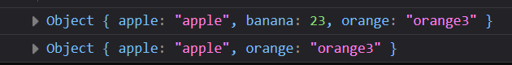

# Задача

Да се напише функција која ќе земе објект и ќе врати нов објект кој ги има само атрибутите кои имаат вредност од тип стринг.



# Решение

```html
<!doctype html>
<html>
  <head>
    <meta charset="UTF-8" />
  </head>
  <body>
    <script type="text/javascript">
      function onlyString(object) {
        let newObject = {};

        for (const property in object) {
          if (typeof object[property] == "string") {
            // ако е од тип string
            newObject[property] = object[property];
          }
        }

        return newObject;
      }

      let fruits = {
        apple: "apple",
        banana: 23,
        orange: "orange3",
      };

      console.log(fruits);
      console.log(onlyString(fruits));
    </script>
  </body>
</html>
```
