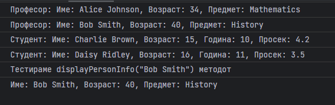

# Задача

Напиши програма која ќе претставува едноставен систем за менаџирање на училиште. Потребно е да се направи класа Person од која ќе наследуваат класите Teacher и Student.
Класата Person има атрибути име и возраст и метод getDetails() кој враќа стринг со податоци за атрибутите. Класата Teacher има додатен атрибут предмет (String означувајќи предметот кој го предава) и студенти (листа од студенти на кои предава) како и апдејтиран getDetails() метод. Класата Student потребно е да има атрибут година, просечна оцена како и апдејтиран getDetails() метод.
Потребно е и да се дефинира класа School која има атрибути за професори и студенти. Потребно е и да се дефинираат методите:
addTeacher(teacher): Додава објект во атрибутот за професори.
addStudent(student): Додава објект во атрибутот за студенти.
displayPersonInfo(): Метод кој го повикува методот getDetails() од сите професори и студенти и кажува дали се студент или професор.
findPersonByName(name): Ја наоѓа личноста со даденото име (без разлика дали е студент или професор) и го повикува нивниот getDetails() метод.



# Решение

```html
<!doctype html>
<head>
    <meta charset="UTF-8">
</head>
<body>
<script type="text/javascript">
    // Се дефинира класата Person
    class Person {
        constructor(name, age) {
            this.name = name;
            this.age = age;
        }

        getDetails() {
            return `Име: ${this.name}, Возраст: ${this.age}`;
        }
    }

    // Се дефинира класата Teacher
    class Teacher extends Person {
        constructor(name, age, subject) {
            super(name, age);
            this.subject = subject;
        }

        getDetails() {
            return `Име: ${this.name}, Возраст: ${this.age}, Предмет: ${this.subject}`;
        }
    }

    // Се дефинира класата Student
    class Student extends Person {
        constructor(name, age, grade, prosek) {
            super(name, age);
            this.grade = grade;
            this.prosek = prosek;
        }

        getDetails() {
            return `Име: ${this.name}, Возраст: ${this.age}, Година: ${this.grade}, Просек: ${this.prosek}`;
        }
    }

    // Се дефинира класата School
    class School {
        constructor() {
            this.teachers = [];
            this.students = [];
        }

        addTeacher(teacher) {
            this.teachers.push(teacher);
        }

        addStudent(student) {
            this.students.push(student);
        }

        // Итерираме низ сите teacher и student објекти и го повикуваме нивниот
        // getDetails() метод.
        displayPersonInfo() {
            this.teachers.forEach(teacher => {
                console.log("Професор: "+teacher.getDetails());
            });
            this.students.forEach(student => {
                console.log("Студент: "+student.getDetails());
            });
        }

        // Се користи built-in функцијата find и бара низ атрибутот teachers и
        // students и го враќа првиот пронајден кој го има соодветното име.
        // Доколку нема таква личност, враќа порака "Нема личност по тоа име."
        findPersonByName(name) {
            let person = this.teachers.find(teacher => teacher.name === name) ||
                this.students.find(student => student.name === name);
            return person ? person.getDetails() : "Нема личност по тоа име.";
        }
    }
    // Иницијализираме објект School() и додаваме објекти.
    const school = new School();
    school.addTeacher(new Teacher("Alice Johnson", 34, "Mathematics"));
    school.addTeacher(new Teacher("Bob Smith", 40, "History"));
    school.addStudent(new Student("Charlie Brown", 15, 10, 4.2));
    school.addStudent(new Student("Daisy Ridley", 16, 11, 3.5));

    // Тестираме displayPersonInfo() методот.
    school.displayPersonInfo();

    // Тестираме displayPersonInfo() методот.
    console.log("Тестираме displayPersonInfo(\"Bob Smith\") методот");
    console.log(school.findPersonByName("Bob Smith"));
</script>
</body>
</html>
```
