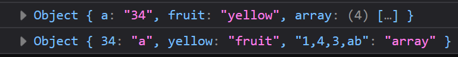

# Задача

Да се напише програма која ќе ги размени својствата и вредностите на објект.



# Решение

```html
<!doctype html>
<html>
  <head>
    <meta charset="UTF-8" />
  </head>
  <body>
    <script type="text/javascript">
      function swap(object) {
        Object.entries(object).forEach((entry) => {
          // entry е во форма [property, value]
          object[entry[1]] = entry[0];
          delete object[entry[0]]; // ја брише старата
        });
      }

      let object = {
        a: "34",
        fruit: "yellow",
        array: [1, 4, 3, "ab"],
      };

      console.log(object);
      swap(object);
      console.log(object);
    </script>
  </body>
</html>
```
