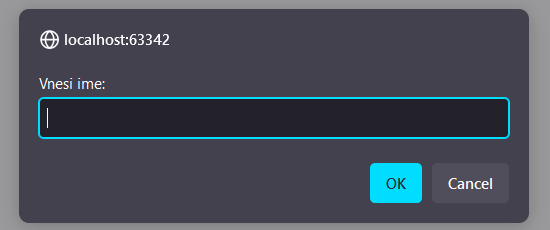
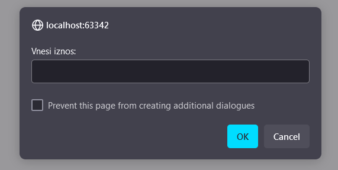
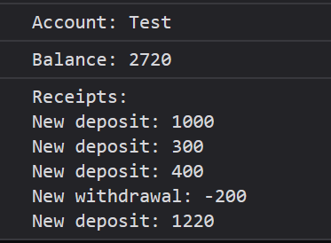

# Задача

Да се креира програма со објект `BankAccount` која содржи име, сметки за трансакции и состојба на сметката (приватен атрибут).
Објектот дополнително да содржи методи за депозит, повлекување и принтање.

Да се овозможи и употреба на кориснички влезови.





# Решение

```html
<!doctype html>
<html>
  <head>
    <meta charset="UTF-8" />
  </head>
  <body>
    <script type="text/javascript">
      function BankAccount(name) {
        let balance = 0; // приватен атрибут
        this.name = name;
        this.transactions = [];

        this.deposit = function (amount) {
          balance += amount;
          this.transactions.push(`New deposit: ${amount}`);
        };

        this.withdraw = function (amount) {
          balance -= amount;
          this.transactions.push(`New withdrawal: -${amount}`);
        };

        this.print = function () {
          console.log(`Account: ${this.name}`);
          console.log(`Balance: ${balance}`);
          console.log(`Transactions: \n${this.transactions.join("\n")}`);
        };
      }

      const account = new BankAccount(prompt("Vnesi ime:"));
      let amount;

      while ((amount = prompt("Vnesi iznos:"))) {
        amount = parseInt(amount);

        if (isFinite(amount)) {
          // ако е број
          if (amount < 0) account.withdraw(-amount);
          else if (amount > 0) account.deposit(amount);
        }
      }

      account.print();
    </script>
  </body>
</html>
```
