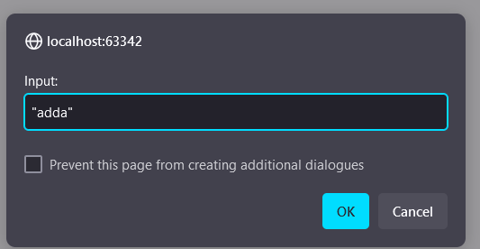
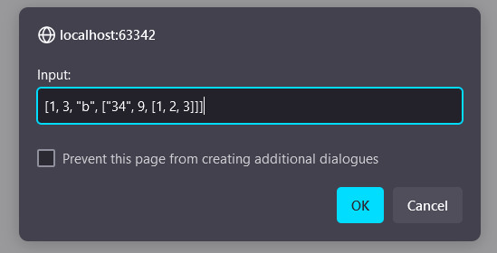
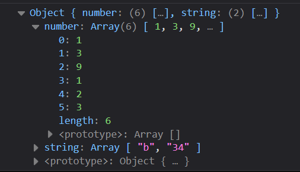

# Задача

Да се напише програма која ќе ги организира корисничките влезови според нивниот тип.
Доколку влезот е листа да се додадат сите вредности од таа листа (вклучувајќи и вгнездени листи).





# Решение

```html
<!doctype html>
<html>
  <head>
    <meta charset="UTF-8" />
  </head>
  <body>
    <script type="text/javascript">
      function organize(object, input) {
        const type = typeof input;

        if (type === "object") {
          // ако е листа во нашиот случај
          input.forEach((value) => organize(object, value)); // проверува и за вгнездени листи
        } else {
          if (!object[type]) object[type] = []; // ако нема таков клуч
          object[type].push(input);
        }
      }

      let object = {};
      let input;

      while ((input = prompt("Input:"))) {
        // влез во форма на JSON
        organize(object, JSON.parse(input));
      }

      console.log(object);
    </script>
  </body>
</html>
```
