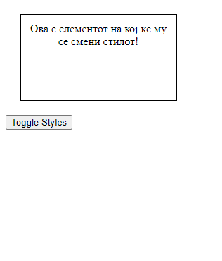
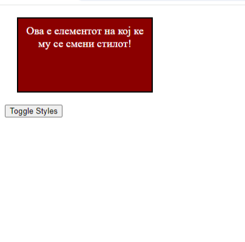
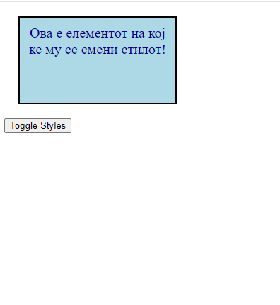

**Вежба 1**

**Преглед**: Потрбно е да се направи елемент на кој ќе може да му се менува стилот.

 - Во оваа вежба потребно е  е да е овозможи на елементот да може да му се менува стилот со клик на копчето Toggle Styles. Елементот ќе менува  помеѓу два различни стила.  
-  На почетокот елементот нема да има никаков стил, со клик на копчето ќе се менуваат двата избрани стилови.
 - Подолу е даден изгледот на елементите пред и по кликање на копчето.

 
