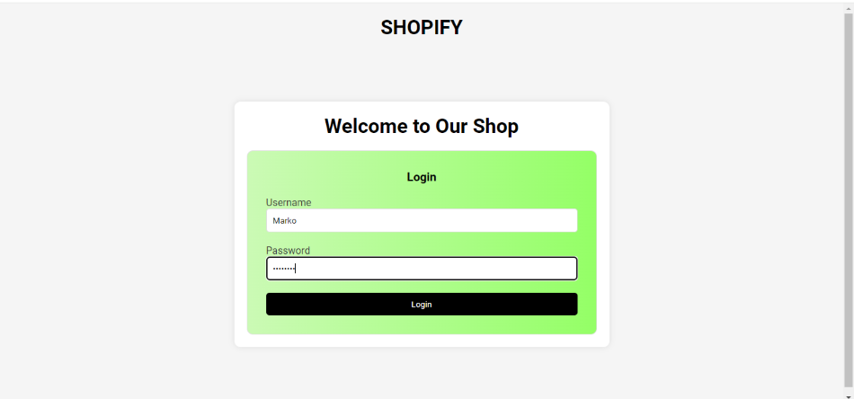
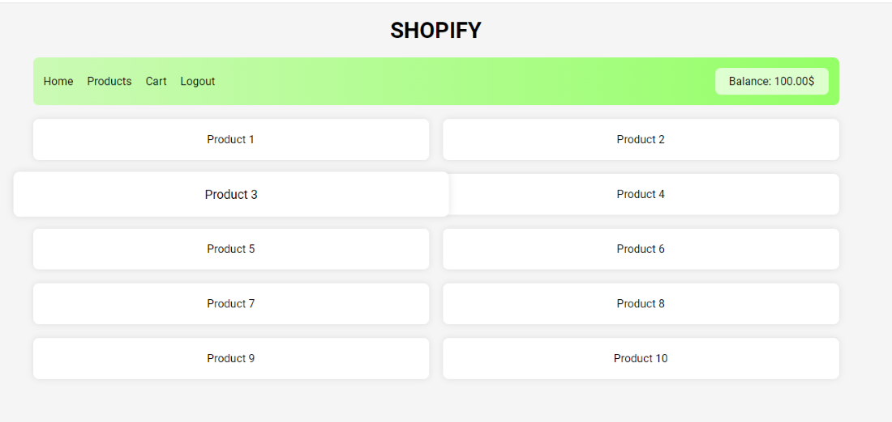
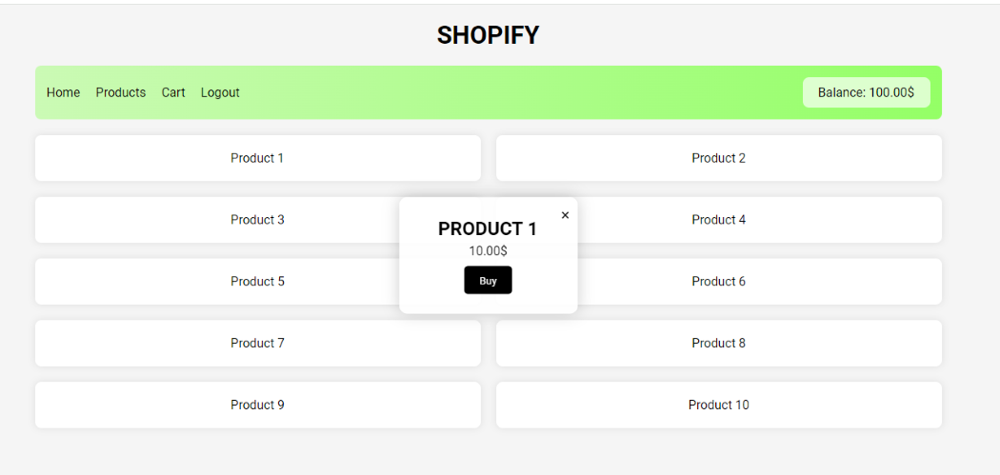
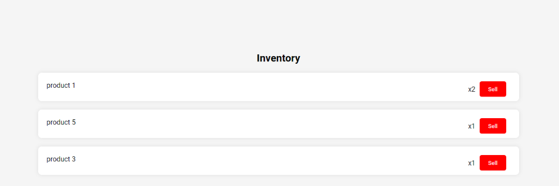
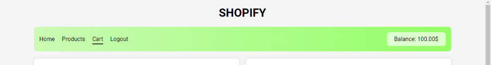
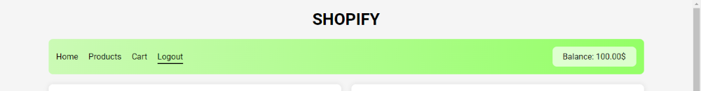

**Вежба 10**
- Веб сајт за  e-commerce

**Преглед:** Креирање на веб сајт за продавање на продукти

**Инструкции**:  
- Пред да се влезе се дефинира корисник (user) кој ќе има username, password и balance (средства со кој ќе располага)

- **Креирање на продукти:**
    - Секој продукт има свое име, број на такви продукти во продавницата и своја цена.
- **Влезна страница**:
   - На влезната страница се прикажува поле во кое се внесува соодветниот username  и password за тој user
   -  Не е дозволен влез за неточен  username или password
   - Со кликање на копчето login  се влегува во страницата во која се продаваат продуктите

- **Страната на продавницата**:  
  - По кликање на копчето login  се влегува во страницата
  
  - На страницата се прикажани сите продукти
  - Во горниот десен агол стои balance односно средствата со кој располага корисникот
  
  - При кликање на било кој од продуктите се појавува pop-up во кој:
    - го пишува името на продуктот, неговата цена и во горниот десен агол има копче за излез од pop-up-от и најдолу има копче buy
    - при кликање на копчето buy се купува одреден производ и се става во *Inventory*
   - Важно е да се напомене дека ако корисникот нема доволно средства за одреден продукт нема да може да го купи
   
 - Во *Inventory*  стојат сите купени продукти и количината што е купена од одреден продукт.
   - Приказот на *Inventory* може да се види со кликање на копчето Cart

При кликање на копчето **Logout** се враќате на почетниот екран каде повторно треба да се внесат соодветниот username  и password за тој user

 *Изглед на log-in формата*
 

*Изглед на страницата по влез*

*Изглед на pop-up при кликање на некој од продуктите*

*Изглед на Inventory*

*При кликање на копчето Cart може да се види Inventory*

*При кликање на копчето Logout се излегува од страницата*
