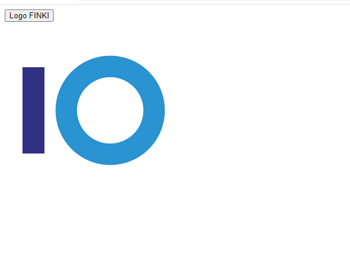

**Вежба 2**
- Појавување на лого со анимација

**Преглед:** Потребно е да се се појавува лого со анимација

**Инструкции**: Да се овозможи при кликање на копчето "Logo FINKI" да се појавува претходно креираното лого на екран со анимација. При повторно кликање на копчето потребно е да се трга логото од страната.
- Притоа да се додаде логото на div елементот како child element

  
