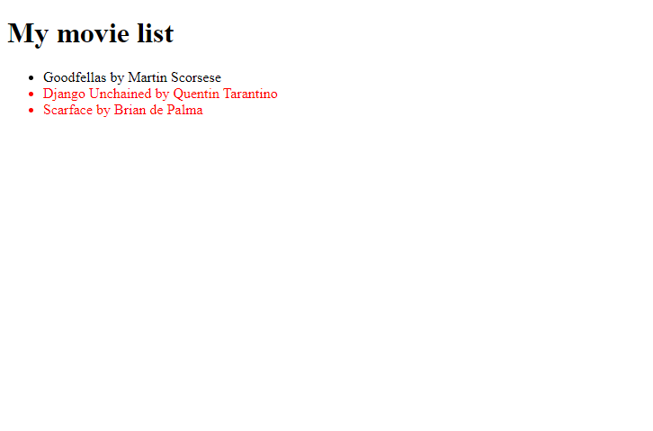

**Вежба 3**

**Преглед:** Креирање на листа и додавање на елементи земени од објекти

**Инструкции:**
- Потребно е за секој филм од низата од филмови movies да се направи p елемент со насловот и авторот на филмот и да се додаде на страната.
- За приказ да се користи ul.
- Филмовите кои не се гледани да се обојат со црвено.
- Информациите потребни за филмовите се дадени во листа од објекти за секој филм кои има: наслов, режисер, и променлива за дали е гледан филмот.

  
