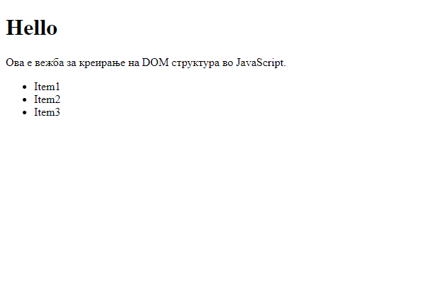

**Вежба 4**
- Креирање на структура

**Преглед:** Во оваа вежба ќе се креира структура преку javascript

**Инструкции**: Структурата што ќе се креира ќе содржи div каде ќе има наслов, еден параграф и една листа со 3 елементи. 
- Таа треба да го има следниот изглед:

