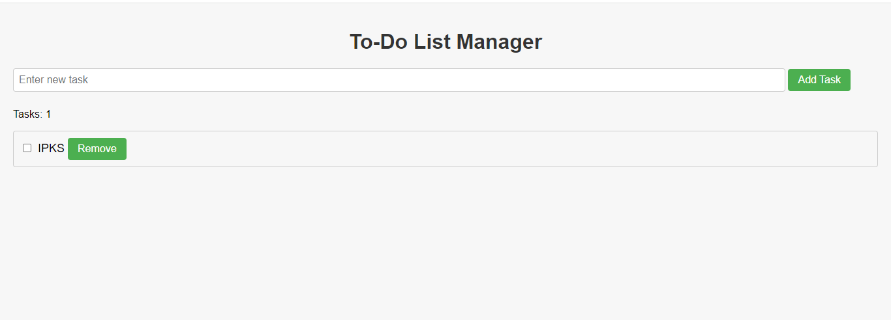

**Вежба 5**
- Креирање на листа со обврски

**Преглед:** Листа во која ќе се внесуваат обврски 

**Инструкции**:  Потребно е да се прочита обврската која е земена.
- Ако не е внесено ништо, се појавува alert.
- Треба да се овозможи и бришење на обврските од листата со кликање на копчето remove.
- Треба да се имплементира и бројач кој ќе го брои бројот на активни обврски.

  
