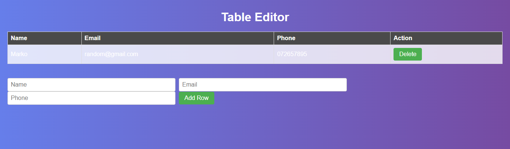

**Вежба 6**
- Креирање на табела

**Преглед:** Табела во која ќе се додаваат редови 

**Инструкции**:  
- Потребно е да се внесе име,емаил и телефонски број.
- За овие податоци треба да се види дали се сите внесени.
- Треба да се овозможи да може да се додаават редови во табелата кој ќе ги содржат податоците
- Треба да има функција која со клик на копче ќе може да брише редови. 
-  Потребно е да се ресетираат вредностите по внес.

  
