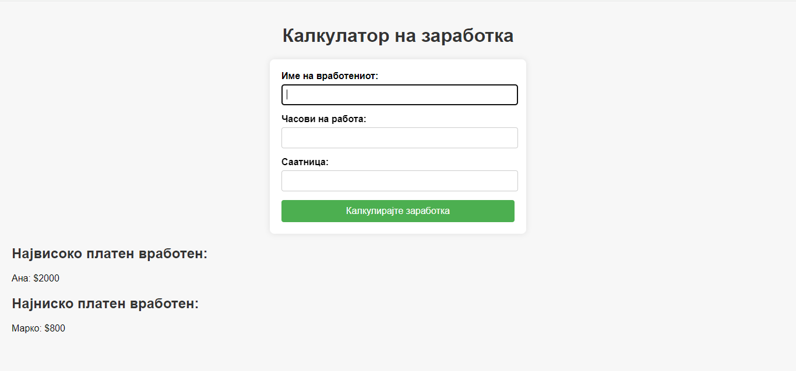

**Вежба 7**
- Калкулатор за плата на вработени

**Преглед:** Креирање на калкулатор кој пресметува плата

**Инструкции**:  
- Се внесуваат името и часовите кој ги работел вработениот.
- Потребно е да се внесат и двата параметри, во спротивно излегува alert.
- Минималното работно време е  20 часа.
- Потребно е да се направи пресметка за платата на вработениот според *(бројот на часови &times; платата по час)*
- Во зависност од платата се менуваат параметрите за намногу платен вработен и најмалку платен вработен
- На почетокот нема да има ни најмалку платен ни најмногу платен вработен. 
- Потребно е да се ресетираат вредностите по внес.

  
