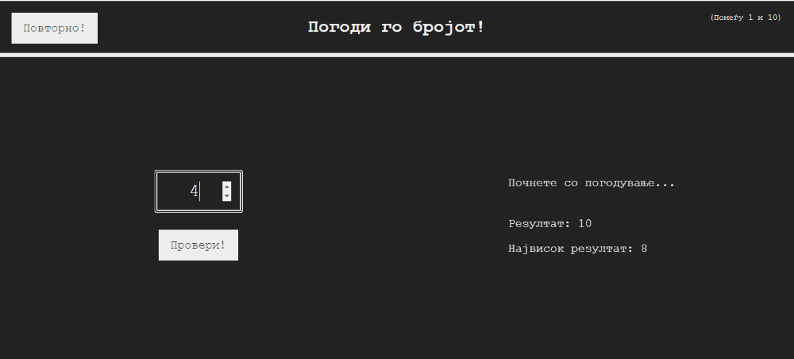
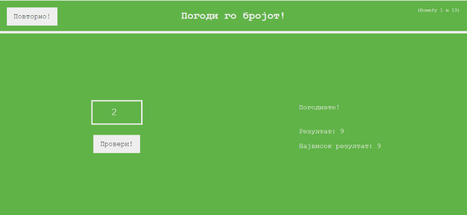

**Вежба 8**
- Игра: Погоди го бројот

**Преглед:** Креирање на игра каде треба да се погоди број од 1 до 10

**Цел на играта:** Играчот на играта треба да го погодува бројот се додека не е истиот со претходно генерираниот број.

**Инструкции**:  
- Се генерира еден рандом број помеѓу 1 и 10.
- Играчот внесува број во полето.
- Моменталниот резултат на играчот е прикажан од страна. 
   - Резултатот е всушност бројот на погодоци потребни на играчот да го погоди бројот.
- При внес на број се појавува порака дали ранодом генерираниот број е поголем или помал од внесениот.     
- Од страната се чува и highscore односно најдобриот резултат од сите погодоци.
- При погодување на бројот:  се појавува порака која не известува дека сме погодиле и завршува играта. По завршување може да се кликне копчето Повторно! преку кое ќе почнете со нова игра.

  
  *Изглед на играта и поставеност на работите додека се игра*
  
  (на местото на "Почнете со погодување..." при клик на копчето Провери! треба да се прикаже пораката за тоа дали внесениот број е помал или поголем од генерираниот)
  
  
  *Изглед на играта кога играчот ќе го погоди бројот*
