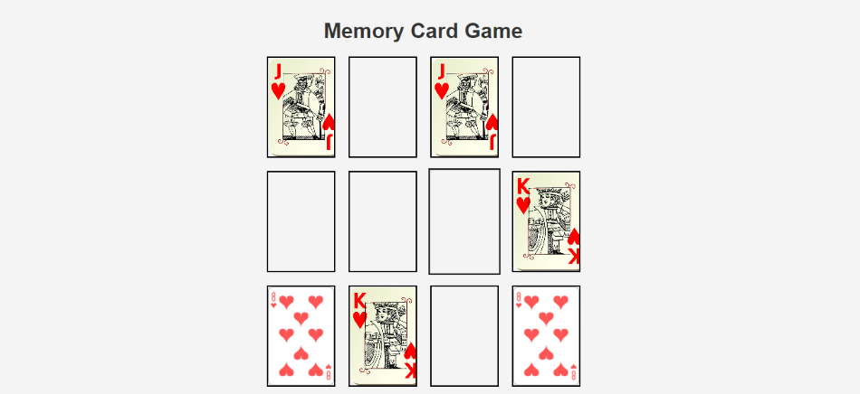

**Вежба 9**
- Игра: Меморија

**Преглед:** Креирање на игра каде треба да се спарат сите парови на карти

**Цел на играта:** Играчот на играта треба да ги спари сите парови на карти.

**Инструкции**:  
- Дадени се 6 парови на карти.
- Најпрво потребно е тие да се размешаат.
- Потоа се ставаат на свое место.
- При клик на картата таа се отвара
   - Во случај да се отворени две карти кои се исти во истиот момент тие остануваат отворени
   - Во спротивно повторно се затвораат.
- Играта завршува кога сите парови на карти ќе бидат спарени. Во тој случај се појавува на екран "Congratulations!"
- Потребно е да се овозможи копче кое при клик повторно ќе генерира нова игра.

  
  *Изглед на играта при играње*
  
  (Картите кои се спарени остануваат отворени, тие кои не се добро спарени повторно се свртени наопаку)

  
  *Изглед на играта кога ќе заврши*
