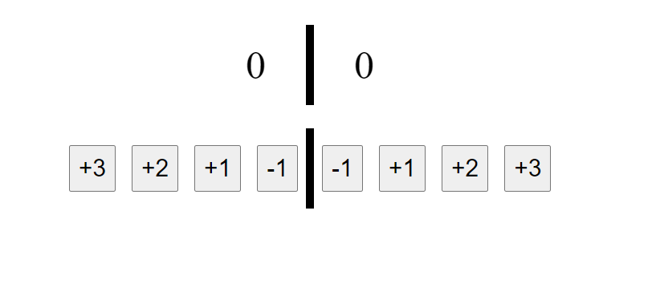
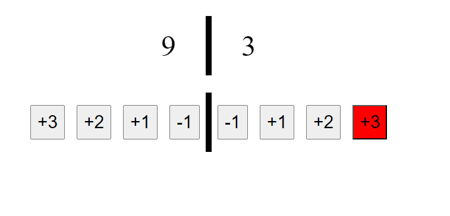

# Интернет програмирање

# Настани

# Задача 1

Да се креира едноставен бројач за додавање на поени за натпревари во кошарка. Потребно е да се чува резултатот на 2 тимови што играат. На соодветниот тим да се додаде 1, 2 или 3 поени. Исто така, да се воведе и одземање на 1 поен, доколку се случи грешка при додавање поени (пример, по грешка се додаваaт 3 поени наместо 2 поени).

Копчето што е црвено означува дека е притиснато тоа копче, не треба да се имплементира таа функционалност.




```html
<!DOCTYPE html>
<html lang="en">
  <head>
    <meta charset="UTF-8" />
    <meta name="viewport" content="width=device-width, initial-scale=1.0" />
    <title>Kosarka</title>
    <style>
      div {
        display: flex;
        justify-content: space-around;
        align-items: center;
      }
      p {
        font-size: 50px;
        margin: 50px;
      }

      .border {
        width: 10px;
        height: 100px;
        background-color: black;
      }

      #main {
        display: flex;
        flex-direction: column;
        justify-content: space-around;
        align-items: center;
      }

      button {
        font-size: 30px;
        padding: 10px;
        margin: 10px;
      }

      button:hover {
        background-color: red;
      }
    </style>
  </head>
  <body>
    <div id="main">
      <div>
        <p id="teamOne">0</p>
        <div class="border"></div>
        <p id="teamTwo">0</p>
      </div>

      <div>
        <div>
          <button onclick="addPoints(3, 1)">+3</button>
          <button onclick="addPoints(2, 1)">+2</button>
          <button onclick="addPoints(1, 1)">+1</button>
          <button onclick="addPoints(-1, 1)">-1</button>
        </div>
        <div class="border"></div>
        <div>
          <button onclick="addPoints(-1, 2)">-1</button>
          <button onclick="addPoints(1, 2)">+1</button>
          <button onclick="addPoints(2, 2)">+2</button>
          <button onclick="addPoints(3, 2)">+3</button>
        </div>
      </div>
    </div>

    <script>
      let teamOne = 0;
      let teamTwo = 0;

      function addPoints(points, team) {
        let add = parseInt(points); // парсирање на поените во integer
        let currentTeam = team === 1 ? "teamOne" : "teamTwo"; // декларирање на тековниот тим

        // додавање на поените на тековниот тим
        if (team === 1) {
          teamOne += add;
        } else {
          teamTwo += add;
        }

        // прикажување на поените на тековниот тим
        let score = team === 1 ? teamOne : teamTwo;
        document.getElementById(`${currentTeam}`).innerText = score;
      }
    </script>
  </body>
</html>
```
