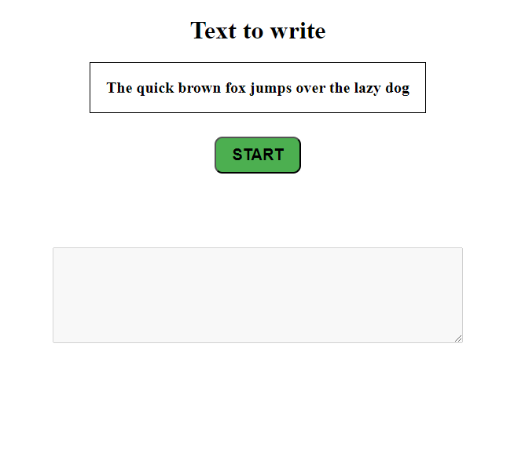
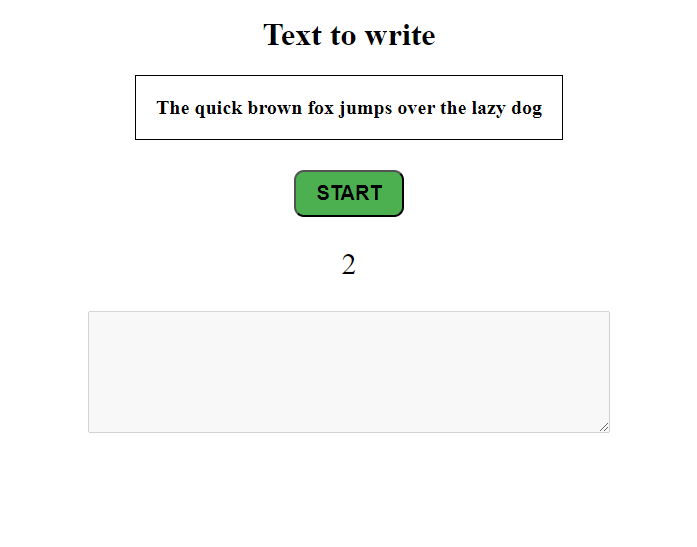
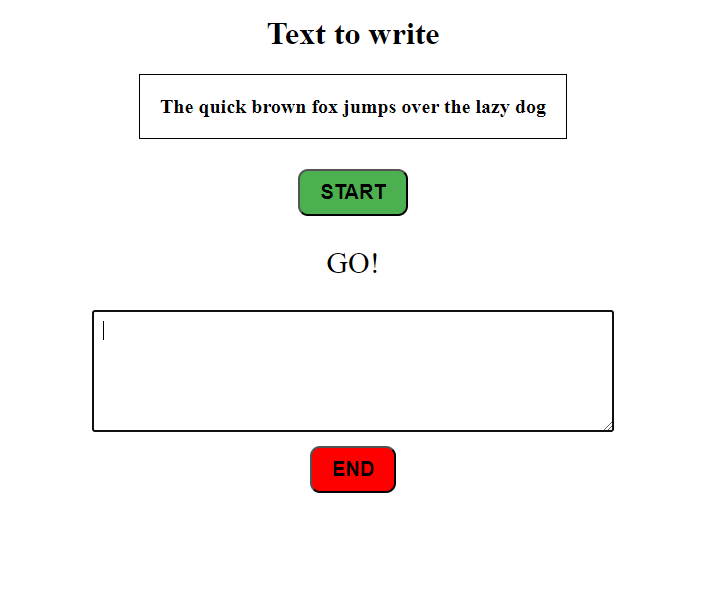
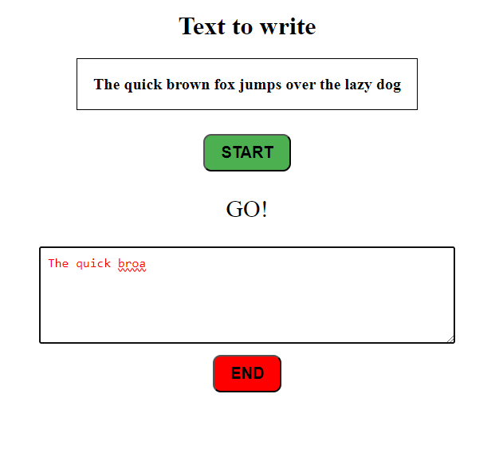
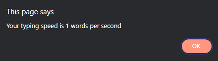
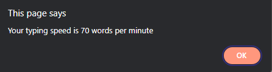
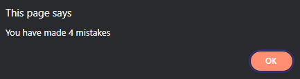

# Интернет програмирање

# Настани

# Задача 10

Во ФИНКИ е организирано натпревар за брзо пишување на тастатура (Typing speed). Потребно е да направете JavaScript програма за да може да се измери колку зборови во секунда може да напише натпреварувачот. Иницијално имате текст кој треба да се пишува и поле каде натпреварувачот ќе го препишува текстот. Во полето на почеток не смее ништо да се пишува, односно е исклучено. Потребно e да има копче „START“ кое при кликање од страна на натпреварувачот се појавува бројач од 3 секунди, откако бројачот ќе постигне 0, се пишува порака “GO” и се овозможува полето за пишување на текстот и на него автоматски се фокусира. Исто така се прикажува и копче "END" за кога ќе заврши натпреварувачот со препишување. При пишување на текстот треба да се води сметка колку пати згрешил натпреварувачот (Кликнал Backspace) исто така доколку при препишувањето тој згреши, треба да му се обојат буквите со црвена боја, ако корисникот ги поправи се враќаат да бидат во црна боја.

На крај кога ќе заврши натпреварувачот со препишување на текстот, го клика копчето "END". Се проверува дали препишаниот текст е ист, ако не е, се појавува соодветна порака дека не е ист. Доколку е се во ред, се појавува колку пати погрешил и колку зборови во секунда тој постигнал исто и колку зборови во минута тој пишувал.

(формула: бројот на зборови во текстот / секунди поминати од кликање старт)

      

```html
<!DOCTYPE html>
<html lang="en">
  <head>
    <meta charset="UTF-8" />
    <meta name="viewport" content="width=device-width, initial-scale=1.0" />
    <title>Document</title>
    <style>
      body {
        display: flex;
        justify-content: center;
        align-items: center;
        flex-direction: column;
      }
      #sample-text-main {
        text-align: center;
      }
      #text {
        font-size: 20px;
        font-weight: bold;
        color: #000;
        border: 1px solid #000;
        padding: 20px;
      }

      #input {
        width: 500px;
        height: 100px;
        padding: 10px;
        font-size: 20px;
        font-size: 16px;
      }

      button {
        padding: 10px 20px;
        font-size: 20px;
        cursor: pointer;
        border-radius: 10px;
        background-color: #4caf50;
        margin-top: 10px;
        font-weight: bold;
      }

      #end {
        background-color: red;
      }
      #timer {
        opacity: 0;
        text-align: center;
        font-size: 30px;
      }

      #end {
        display: none;
      }
    </style>
  </head>
  <body>
    <div id="sample-text-main">
      <h1>Text to write</h1>
      <p id="text">The quick brown fox jumps over the lazy dog</p>
    </div>
    <button id="start" onclick="start()">START</button>
    <div id="input-box">
      <p id="timer">3</p>
      <textarea disabled id="input"></textarea>
    </div>

    <button id="end">END</button>

    <script>
      // поставување старт бројчач
      function start() {
        var timer = 3;

        // поставување на интервал за бројачот да се намалува секоја секунда
        var interval = setInterval(function () {
          document.getElementById("timer").style.opacity = 1; // го правиме видлив бројачот
          document.getElementById("timer").innerText = timer; // го поставуваме тексот на бројачот
          timer--;
          if (timer < 0) {
            clearInterval(interval); // го стопираме интервалот за бројачот и овозможуваме на корисникот да внесува текст
            document.getElementById("timer").innerText = "GO!";
            document.getElementById("input").disabled = false;
            document.getElementById("input").focus();
            document.getElementById("end").style.display = "block";
            startCalculateTypingSpeed(); // се повикува функција за мерење на брзина на пишување
          }
        }, 1000);
      }

      function startCalculateTypingSpeed() {
        // иницијално, го зимаме моменталното време и при клик на копчето за крај, го зимаме пак моменталното време и го споредуваме со претходното
        var start = new Date().getTime();
        document.getElementById("end").addEventListener("click", function () {
          // проверка на дали текстот е ист како оној што е внесен. Ако не е, се прикажува алерт порака и се прекинува функцијата
          if (
            document.getElementById("input").value !=
            document.getElementById("text").innerText
          ) {
            alert(
              "Text is not the same as the input, please write the same text as the one above"
            );
            return;
          }

          // го зимаме пак моменталното време
          var end = new Date().getTime();

          // го пресметуваме времето во секунди
          var time = (end - start) / 1000;

          // го зимаме текстот од параграфот и внесениот текст
          var text = document.getElementById("text").innerText;
          var input = document.getElementById("input").value;

          // ги сплитуваме текстовите по празно место
          var words = text.split(" ");
          var inputWords = input.split(" ");

          // го броиме колку зборови се исти
          var correctWords = 0;
          for (var i = 0; i < words.length; i++) {
            if (words[i] == inputWords[i]) {
              correctWords++;
            }
          }

          // го пресметуваме брзината на пишување и ја прикажуваме во алерт. Исто и бројот на грешки
          var speed = correctWords / time;
          alert(
            "Your typing speed is " + parseInt(speed) + " words per second"
          );
          alert(
            "Your typing speed is " + parseInt(speed * 60) + " words per minute"
          );
          alert("You have made " + backspace + " mistakes");
        });
      }

      // бројач за бројот на бришења на текстот
      var backspace = 0;
      document
        .getElementById("input")
        .addEventListener("keydown", function (event) {
          if (event.key == "Backspace") {
            backspace++;
          }
        });

      // еvent listener за проверка на текстот дали е точен. Ако не е, текстот се бои во црвено.
      document.getElementById("input").addEventListener("keyup", function () {
        var input = document.getElementById("input").value;
        var text = document.getElementById("text").innerText;
        var textChars = text.split("");
        var inputChars = input.split("");

        // проверка на секој карактер дали е точен, ако не е текстот се бои во црвено.
        for (var i = 0; i < inputChars.length; i++) {
          if (textChars[i] != inputChars[i]) {
            document.getElementById("input").style.color = "red";
            return;
          }
        }

        // во друг случај текстот е точен и се бои во црно
        document.getElementById("input").style.color = "black";
      });
    </script>
  </body>
</html>
```
