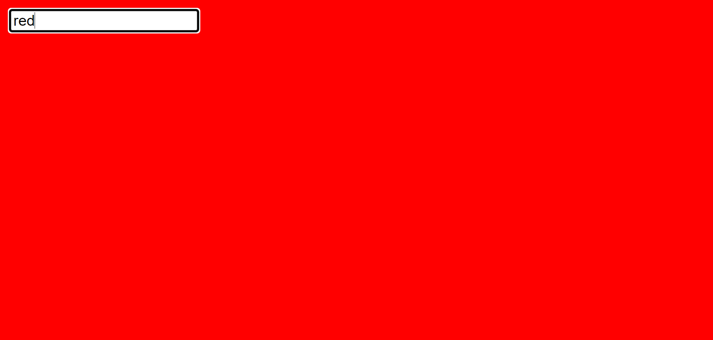

# Интернет програмирање

# Настани

# Задача 2

Компанија за тапети разгледува различни бои за нивните дизајни. Потребно и е брз начин да може да ги прегледуваат боите. Да се направи текст поле каде што при внес на име на боја (од CSS на пример “red”) позадината се менува во таа боја. Бојата се менува веднаш откако е напишана.




```html
<!DOCTYPE html>
<html lang="en">
  <head>
    <meta charset="UTF-8" />
    <meta name="viewport" content="width=device-width, initial-scale=1.0" />
    <title>Tapeti</title>
  </head>
  <body>
    <input
      type="text"
      id="textInput"
      placeholder="Внесете боја"
      onkeyup="changeColor()"
    />
    <!-- внесување на боја и поставување на onkeyup event -->

    <script>
      function changeColor() {
        // ги земаме вредностите од input полето
        let input = document.getElementById("textInput").value;

        // го менуваме бојата на body со вредноста од input полето
        let body = document.querySelector("body");
        body.style.backgroundColor = input;
      }
    </script>
  </body>
</html>
```
