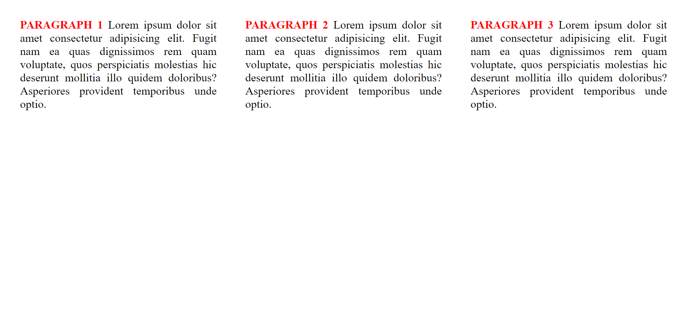
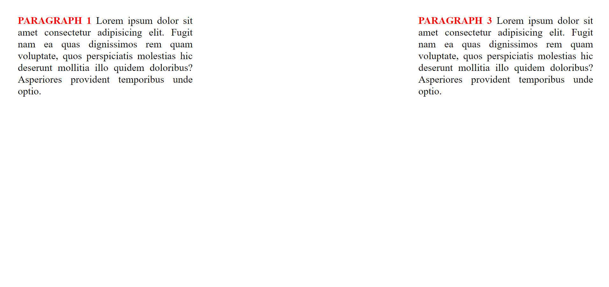

# Интернет програмирање

# Настани

# Задача 3

Да се направи веб страница каде ќе имате 3 параграф елементи кои при hover со покажувачот, елементите ги снемува и не се гледаат повеќе се додека не се отстране покажувачот. Напомена, не смее да се менува структурата на страната.




```html
<!DOCTYPE html>
<html lang="en">
  <head>
    <meta charset="UTF-8" />
    <meta name="viewport" content="width=device-width, initial-scale=1.0" />
    <title>Document</title>

    <style>
      #main {
        display: flex;
        justify-content: space-around;
        align-items: center;
      }
      p {
        margin: 20px;
        text-align: justify;
        transition: opacity 0.5s;
      }

      span {
        color: red;
        font-weight: bold;
      }
    </style>
  </head>
  <body>
    <div id="main">
      <!-- Поставување 3 параграфи со произволен текст -->
      <!-- Поставување onmouseover и onmouseout event за да може да гледаме дали корисникот со покажувачот е врз параграфот. -->
      <!-- Ја повикуваме hide i show функцијата исто и аругмент this кој е покажувачот кон моменталниот html елемент -->

      <p onmouseover="hide(this)" onmouseout="show(this)">
        <span>PARAGRAPH 1 </span> Lorem ipsum dolor sit amet consectetur
        adipisicing elit. Fugit nam ea quas dignissimos rem quam voluptate, quos
        perspiciatis molestias hic deserunt mollitia illo quidem doloribus?
        Asperiores provident temporibus unde optio.
      </p>

      <p onmouseover="hide(this)" onmouseout="show(this)">
        <span>PARAGRAPH 2 </span>Lorem ipsum dolor sit amet consectetur
        adipisicing elit. Fugit nam ea quas dignissimos rem quam voluptate, quos
        perspiciatis molestias hic deserunt mollitia illo quidem doloribus?
        Asperiores provident temporibus unde optio.
      </p>

      <p onmouseover="hide(this)" onmouseout="show(this)">
        <span>PARAGRAPH 3 </span>Lorem ipsum dolor sit amet consectetur
        adipisicing elit. Fugit nam ea quas dignissimos rem quam voluptate, quos
        perspiciatis molestias hic deserunt mollitia illo quidem doloribus?
        Asperiores provident temporibus unde optio.
      </p>
    </div>

    <script>
      // За да не ја менуваме структурата на страната, нема да користиме display: none, туку ќе користиме opacity.

      function hide(element) {
        element.style.opacity = "0";
      }

      function show(element) {
        element.style.opacity = "1";
      }
    </script>
  </body>
</html>
```
