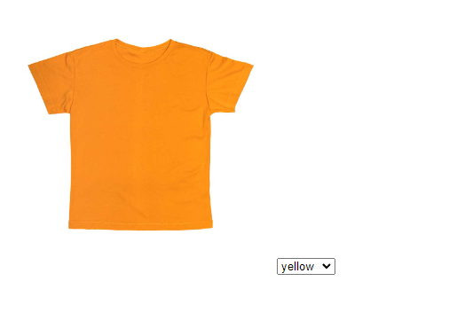
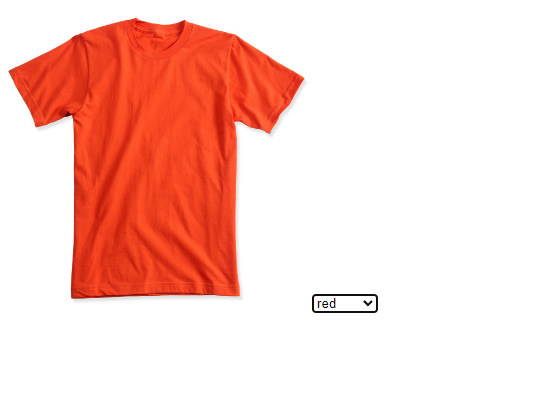

# Интернет програмирање

# Настани

# Задача 7

Потребно е на една еcommerce фирма да може корисникот да избира варијанти на продукт. Потребно е да поставите слика и select елемент со повеќе опции (варијанти), при избор на некои од овие опции сликата треба да се смени соодветно на опцијата.

 

```html
<!DOCTYPE html>
<html lang="en">
  <head>
    <meta charset="UTF-8" />
    <meta name="viewport" content="width=device-width, initial-scale=1.0" />
    <title>Document</title>
    <style>
      img {
        width: 300px;
        height: 300px;
      }
    </style>
  </head>
  <body>
    

    <!-- се поставува onchange event на select елементот -->
    <select id="variant" onchange="changeVariant()">
      <option value="p1-4.jpg">yellow</option>
      <option value="testshirt.jpg">red</option>
      <option value="orange.webp">orange</option>
    </select>

    <script>
      // функција која се повикува кога ќе се смени вредноста на select елементот
      function changeVariant() {
        var img = document.getElementById("image");
        var variant = document.getElementById("variant").value;
        img.src = variant;
      }
    </script>
  </body>
</html>
```
