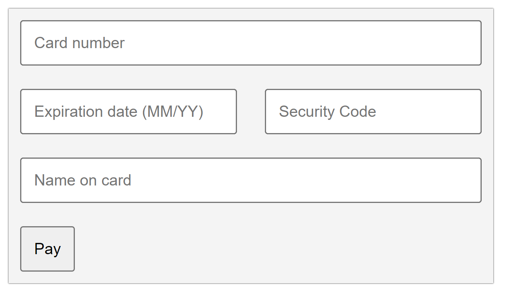

# Интернет програмирање

# Настани

# Задача 8

Една еcommerce фирма и е потребно checkout секција во нивна веб страница, каде што ќе може корисникот да си ја внесе својата платежна картичка за наплата. Напревете формулар за внесување на платежна картичка и проверете дали е таа валидна при клик на submit копчето, доколку не е валидна да се прикаже соодветна порака. Платежната картичка е валидна ако се состои само од цифри и е долга 16 цифри, датумот исто така не смее да биде истечен и CVC е составено само од цифри и е долго 3 цифри. (Бонус: валидитирајте ги картичките со Luhn’s algorithm)



```html
<!DOCTYPE html>
<html lang="en">
  <head>
    <meta charset="UTF-8" />
    <meta name="viewport" content="width=device-width, initial-scale=1.0" />
    <title>Document</title>
    <style>
      form {
        background-color: #f4f4f4;
        width: fit-content;
        box-shadow: 0px 0px 1px 0px #000000;
        display: flex;
        flex-direction: column;
      }
      input {
        margin: 10px;
        padding: 10px;
        /* box shadow */
      }
      button {
        margin: 10px;
        padding: 10px;
        background-color: #4caf50;
        color: white;
        border: none;
        cursor: pointer;
      }
    </style>
  </head>
  <body>
    <form>
      <input type="text" name="card" placeholder="Card number" id="card" />
      <div>
        <input
          type="text"
          name="date"
          placeholder="Expiration date (MM/YY)"
          id="date"
        />
        <input type="text" name="cvc" placeholder="Security Code" id="cvc" />
      </div>
      <input type="text" name="name" placeholder="Name on card" id="name" />
      <div>
        <input type="submit" value="Pay" />
      </div>
    </form>

    <script>
      // на submit event на формата да се изврши следната функција
      document
        .querySelector("form")
        .addEventListener("submit", function (event) {
          // да се спречи default-то однесување на формата
          event.preventDefault();

          // се зимат податоци од полињата
          let card = document.getElementById("card").value;
          let date = document.getElementById("date").value;
          let cvc = document.getElementById("cvc").value;
          let name = document.getElementById("name").value;

          // се правиат проверки дали сите полиња се пополнети
          if (
            card.length != 16 ||
            date.length < 5 ||
            cvc.length < 3 ||
            name.length < 3
          ) {
            alert("Please fill all fields correctly");
            return;
          }

          let cardSplited = card.split("");

          // проверка дали сите карактери во картичниот број се броеви
          for (let number of cardSplited) {
            if (isNaN(number)) {
              alert("Card number must contain only numbers");
              return;
            }
          }

          // проверка дали cvc е број
          if (isNaN(cvc)) {
            alert("CVC must contain only numbers");
            return;
          }

          // проверка дали датумот е во формат MM/YY
          let dateSplited = date.split("/");
          if (dateSplited.length != 2) {
            alert("Date must be in format MM/YY");
            return;
          }
          if (isNaN(dateSplited[0]) || isNaN(dateSplited[1])) {
            alert("Date must contain only numbers");
            return;
          }
          if (dateSplited[0] > 12 || dateSplited[0] < 1) {
            alert("Month must be between 1 and 12");
            return;
          }
          if (dateSplited[1] < 24) {
            alert("Card is expired");
            return;
          }

          // БОНУС: проверка на валидност на картичниот број со Лун алгоритам (Luhn algorithm)
          let cardNumber = cardSplited.map(Number);
          let sum = 0;
          for (let i = 0; i < cardNumber.length; i++) {
            if (i % 2 == 0) {
              cardNumber[i] *= 2;
              if (cardNumber[i] > 9) {
                cardNumber[i] -= 9;
              }
            }
            sum += cardNumber[i];
          }
          if (sum % 10 != 0) {
            alert("Card number is not valid");
            return;
          }

          alert("Payment successful");
        });
    </script>
  </body>
</html>
```
