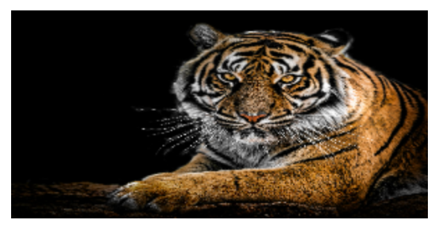
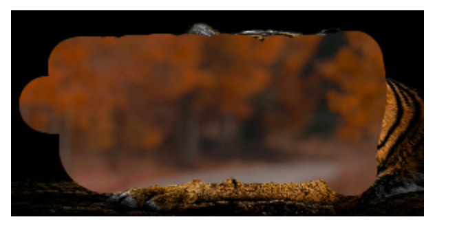

# Интернет програмирање

# Настани

# Задача 9

Да се направи апликација за грепка во JavaScript. Потребни се 2 слики со иста големина. Првата слика ќе биде скриена, а втората слика ќе биде позиционирана на првата. Со помош на „гребење“ (движење со притиснат покажувач над сликата) полека да се прикажи првата слика.

 

```html
<!DOCTYPE html>
<html>
  <head>
    <title>Scratch Card</title>

    <style>
      #scratchCard {
        width: 300px;
        height: 150px;
        background-image: url("images/background-image.jpg");
        background-size: cover;
        position: relative;
      }

      canvas {
        position: absolute;
        top: 0;
        left: 0;
      }
    </style>
  </head>
  <body>
    <!-- за да може да постигнеме ефект за грепка, потребно ние да искористеме canvas html tag. -->
    <div id="scratchCard">
      <canvas id="canvas"></canvas>
    </div>

    <script>
      // идејата е да се исцрта сликата која ќе ја гребеме
      const canvas = document.getElementById("canvas");
      // го земаме контекстот на canvas
      const ctx = canvas.getContext("2d");
      const scratchCard = document.getElementById("scratchCard");
      const image = new Image();

      // кога ќе се вчита сликата, истата ќе се исцрта на canvas
      image.onload = function () {
        ctx.drawImage(image, 0, 0, canvas.width, canvas.height);

        // го поставуваме глобалниот композитен оператор на destination-out
        ctx.globalCompositeOperation = "destination-out";

        // кога ќе кликнеме на canvas, ќе започнеме со грепка
        canvas.addEventListener("mousedown", startScratch);

        // кога ќе се движиме ќе го гребе canvas-от
        canvas.addEventListener("mousemove", scratch);

        // кога ќе го пуштиме кликот, ќе престанеме со гребкање
        canvas.addEventListener("mouseup", stopScratch);
      };

      // го поставуваме изворот на сликата на која сакаме да биде слој за грепка односно таа одозгора.
      image.src = "images/foreground-image.jpg";

      let isScratching = false;

      // функција за почеток на грепка
      function startScratch(e) {
        isScratching = true;
        scratch(e);
      }

      function scratch(e) {
        if (!isScratching) return;

        // го земаме правоаголникот на canvas-от
        const rect = canvas.getBoundingClientRect();

        // ги земаме координатите на кликот односно каде кликнал корисникот на canvas-от
        const x = e.clientX - rect.left;
        const y = e.clientY - rect.top;

        // го исцртуваме кругот на местото каде кликнал корисникот со радиус 20 и со црна боја за да се гледа подобро каде се гребало canvas-от

        ctx.beginPath();
        ctx.arc(x, y, 20, 0, Math.PI * 2);
        ctx.fill();
      }

      function stopScratch() {
        isScratching = false;
      }
    </script>
  </body>
</html>
```
