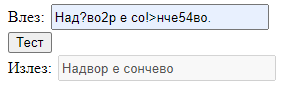

# Задача 1

Да се избришат сите карактери што се различни од буква или празно место од дадениот стринг.



```html
<!DOCTYPE html>
<html lang="en">
<head>
  <meta charset="UTF-8">
  <title>Задача 1</title>
  <style>
      input{
          width: 210px;
          height: 20px;
          margin: 2px;
      }
  </style>
</head>
<body>

<span>Влез: </span><input type="text" id="in"><br>
<button onclick="remove()">Тест</button><br>
<span>Излез: </span><input disabled id="izlez">

<script>

    function remove() {
        let input = document.getElementById("in").value;
        let izlezElem = document.getElementById("izlez");
        let result;

        result = input.replaceAll(/[^a-zA-Zа-шА-Ш\s]/g, "");
        // се' што не е буква или празно место - се брише.
        // a-zA-Z - се означуваат буквите - латиница
        // а-шА-Ш - се означуваат буквите - кирилица
        // \s - се означува празно место

        izlezElem.value = result;
    }
    
</script>

</body>
</html>
```